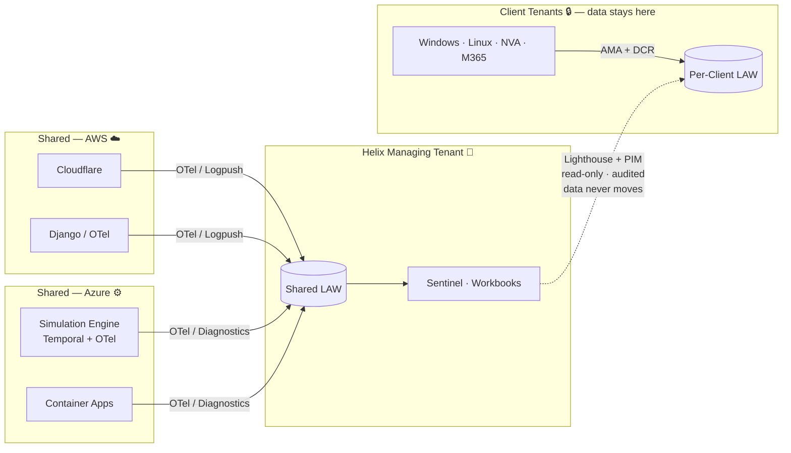
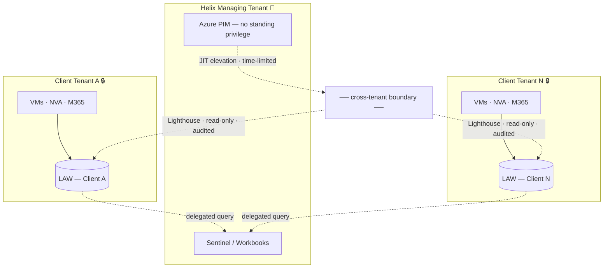
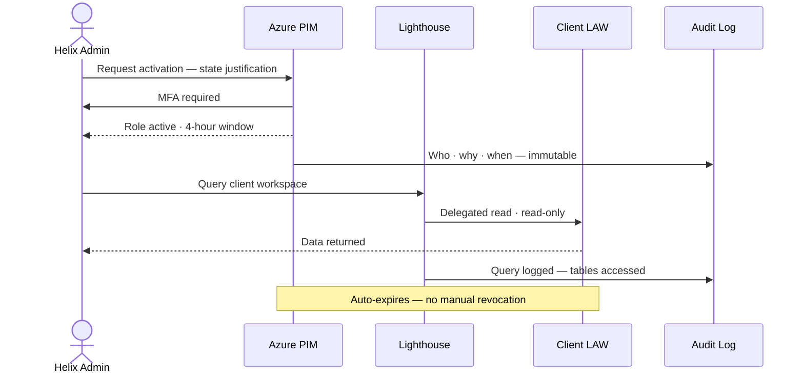
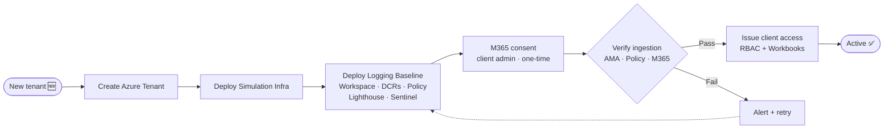

<!-- _class: lead invert -->
<!-- _paginate: false -->

# 🔐 Helix
## Logging Platform Architecture Proposal

*Cross-tenant telemetry · Zero standing access · Automated at scale*

---

<!-- _class: lead invert -->

## Before this is a logging problem —
## it's a **cross-tenant trust problem**

*N isolated client tenants · separate Entra directories · three different audiences*

<!--
TALKING POINTS
- The hard part isn't collecting logs — it's the topology
- Each client is a completely separate Azure Entra directory
- Any solution that ignores this either leaks data between clients, or requires permanent privileged access to every tenant
- Both are non-starters for a cybersecurity platform
- Set up why federated is the obvious answer before showing a diagram
-->

---

# 📡 Three sources. Three audiences. One constraint.

| Sources | Audiences |
|---|---|
| Shared AWS — Cloudflare · Django · Containers | **Developers** — platform debugging only |
| Shared Azure — Simulation Engine · Entra · ACA | **IT Admins / Security** — cross-env visibility |
| Client tenants — Windows · Linux · NVA · M365 | **Clients** — their own data only |

 

> These three audiences must **never share the same access boundary**

<!--
TALKING POINTS
- Three structurally different source types — each needs a different collection path
- Developers must not see client security events
- Clients must not see each other's data
- Admins need cross-env visibility but with accountability for every query
-->

---

# 🏗️ Architecture Overview

<!--
TALKING POINTS
- Walk left to right — sources, collection, storage, access
- The dotted line is the most important: Sentinel QUERIES OUT — data never moves into Helix's tenant
- Client logs stay in the client's Azure environment, always
-->

---

<!-- _class: lead invert -->

# Collect locally
# Govern centrally
# **Access selectively**

<!--
TALKING POINTS
- This is the design stance in one line
- Collect locally = data never leaves the tenant it belongs to
- Govern centrally = one Sentinel, one Workbook layer, one place to manage rules
- Access selectively = JIT elevation, time-limited, every query audited
- Every architecture decision flows from this principle
-->

---

# 🎯 Five decisions that drive everything

| Decision | Choice | Wrong choice costs you |
|---|---|---|
| Collection model | **Federated** — logs stay in tenant | One credential breach → all clients exposed |
| Workspace topology | **One LAW per client** | RBAC gap leaks data across clients |
| Cross-tenant access | **Lighthouse + PIM/JIT** | Blast radius that never closes |
| IaC pattern | **Pulumi ComponentResource** | Silent drift by client 10 |
| Log classification | **Analytics · Basic · Archive** | Paying Sentinel prices for debug noise |

<!--
TALKING POINTS
- Read the left column — the decisions
- For each: state the choice, then what the wrong choice costs
- These are load-bearing — change any one and the architecture changes materially
- The rest of the presentation justifies each of these
-->

---

# 🚧 Three trust boundaries

<!--
TALKING POINTS
- Boundary 1: Helix's own tenant — standard Azure RBAC, least privilege
- Boundary 2: The high-risk one — Lighthouse + PIM is the only crossing point
- Boundary 3: Inside each client tenant — Pulumi-deployed, consistent baseline
-->

---

# ⏱️ How cross-tenant access actually works

<!--
TALKING POINTS
- No standing access — every query requires this flow
- MFA at activation, not just at login
- Every activation AND every query is logged immutably
- Pre-activate at shift start if expecting a live incident
- Full chain of custody in both Helix and client Entra audit logs
-->

---

# ⚠️ Blast radius — honest assessment

**Worst case:** credential compromised + MFA bypassed

| What they **can** do | What they **cannot** do |
|---|---|
| Read all clients' log data | Modify or delete any data |
| For up to **4 hours** | Access compute, network, or identity |
| *(fully audited)* | Extend beyond the PIM window |

 

> Compare to centralised: **unlimited · permanent · no expiry · no per-client isolation**

<!--
TALKING POINTS
- Say this clearly and frame it correctly — don't hide it
- Blast radius: all clients' log data, read-only, 4 hours, fully audited
- The comparison is what matters: centralised has no time limit, no isolation, no expiry
- Federated = harder operationally, materially safer under breach
-->

---

# 🚀 Onboarding — one command, one baseline

<!--
TALKING POINTS
- Every client gets the same baseline through the same code path — no manual steps
- M365 consent: client's Global Admin must click approve — workflow waits up to 48 hours
- Verification gate: AMA heartbeat + Policy compliance + M365 connector active
- 3 retries with backoff — then platform team is paged
-->

---

# 🤖 Temporal — not just another pipeline

|  | GitHub Actions | Temporal |
|---|---|---|
| **Triggered by** | Repository events | Platform / business events |
| **Runtime** | Short-lived jobs | Long-running workflows |
| **State** | External / ad hoc | Built into the model |
| **Recovery** | Re-run the job | Resumes from last state |
| **Waiting** | Awkward for long waits | Native — signals are first-class |

 

> M365 consent can wait **48 hours** — that's not a CI/CD job

<!--
TALKING POINTS
- Both called "workflows" — very different problems
- GitHub Actions: repo event automation, ephemeral, pipeline thinking — right tool for CI/CD
- Temporal: durable stateful processes, survives crashes, waits on external signals
- M365 consent wait alone (48h) makes GitHub Actions the wrong fit
- We still use GitHub Actions for CI/CD (Pulumi deploys, drift checks) — correct use
-->

---

# 💰 Not all logs are equal

| Tier | Cost | Retention | For |
|---|---|---|---|
| **Analytics** | ~$2.30 / GB | 90 days | Security events · audit · product events |
| **Basic** | ~$0.50 / GB | 8 days | Verbose app logs · container output |
| **Archive** | ~$0.02 / GB/mo | Up to 12 years | Compliance · historical forensics |

 

> **DCR transformations** route at ingestion — filtered data is never stored, never charged

<!--
TALKING POINTS
- Flat ingestion = paying Analytics prices for debug noise nobody queries
- DCR transforms route before data lands — most cost-effective lever available
- 80% cost reduction moving from Analytics to Basic
- Archive at $0.02/GB is effectively free for compliance retention
-->

---

# ⚖️ Isolated vs shared — the trade-off

**10 clients · 10 GB/day each · approx. USD**

| | Monthly total |
|---|---|
| 10 isolated workspaces | **~$14,280** |
| 1 shared workspace | **~$12,180** |
| **Difference** | **~$2,100 / month (+15%)** |

 

**The 15% premium buys:**
- Data never co-located across clients · bounded blast radius
- Clean per-client audit trail · per-client retention policies

<!--
TALKING POINTS
- The cost difference is real — don't pretend it isn't
- Frame what it buys: data residency, bounded blast radius, clean audit
- For regulated clients (defence, government) — isolation is likely non-negotiable
- Shared workspace remains a viable lower-cost tier for clients where isolation is a preference
-->

---

# 👥 What changes for each team

| Team | They gain | Upfront ask |
|---|---|---|
| **Infrastructure** | Repeatable onboarding — one Pulumi run | Workspace topology decisions |
| **DevOps** | Policy self-heals gaps — no manual tracking | Build Pulumi component · DCRs · Sentinel rules |
| **Security 🔵 Blue** | Full audit trail · Sentinel across all clients | PIM adds 2–5 min to first query |
| **Security 🔴 Red** | Consistent telemetry — gaps visible via Policy | Validate detection coverage per onboarding |
| **Business / Finance** | Per-client cost attribution via tags | Agree billing model at onboarding |
| **Operations** | Single Workbook layer across all clients | Maintain query packs · runbooks |
| **Software Dev** | Structured traces without elevated permissions | Integrate OTel SDK into Django + Temporal |

<!--
TALKING POINTS
- Don't read the table — scan "They gain", let each team self-identify
- Call out the upfront asks explicitly
- DevOps: several engineering weeks before first client — one-time investment
- Blue team: PIM latency is deliberate, not a bug — pre-activate at shift start
- Software Dev: OTel is real code, not a config toggle
-->

---

# ⚠️ Risk landscape

|  | **Low likelihood** | **High likelihood** |
|---|---|---|
| **High impact** | 🔴 Lighthouse compromise 🔴 Client data challenge | 🟠 Cost explosion 🟠 Inconsistent onboarding |
| **Low impact** | 🟡 AWS log latency 🟡 Pulumi state drift | 🟡 NVA format issues 🟡 M365 coverage gaps |

<!--
TALKING POINTS
- Lighthouse compromise: top-left — low probability, critical impact — deliberate placement
- Mitigations keep it there: PIM/JIT, scoped delegation, hardened managing tenant
- Cost explosion and inconsistent onboarding: medium probability — both directly addressed
- Key message: we know where the risks are, we've designed for them
-->

---

# 🛡️ Residual risk — federated vs centralised

| | Federated *(this proposal)* | Centralised *(alternative)* |
|---|---|---|
| Credential compromise | Read-only · all clients · **4 hours max** | Read-only · all clients · **unlimited** |
| Data residency | Client data stays in client tenant | All clients co-located |
| Blast radius | Bounded by PIM window | Unbounded |
| Audit trail | Immutable · per-client | Commingled |

 

> Federated = harder operational posture · **materially safer breach posture**

<!--
TALKING POINTS
- Residual risk is acceptable for a cybersecurity simulation platform
- Federated is harder to operate and significantly better under breach
- Close by naming the trade-off honestly, then hand it to the room
-->

---

<!-- _class: lead invert -->
<!-- _paginate: false -->

# Centralise **control**.
# Centralise **visibility**.
# Never centralise **risk**.

*Full proposal → github.com/danielcorrea89/helix-logging-proposal*

<!--
TALKING POINTS
- End on the design principle, not on a risk slide
- Invite questions — don't rush to close
- Have the docs open in browser tabs for deep dives
-->
