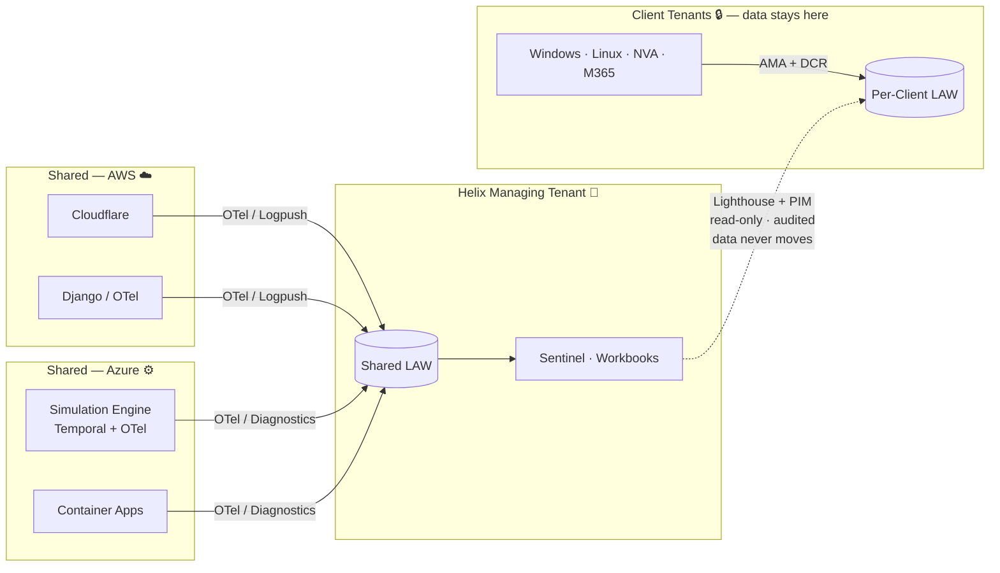
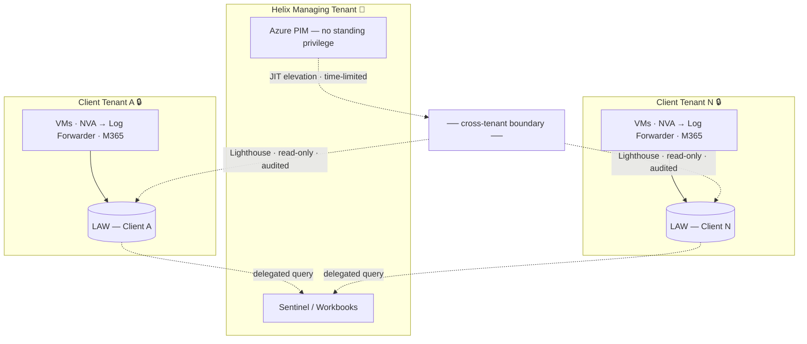
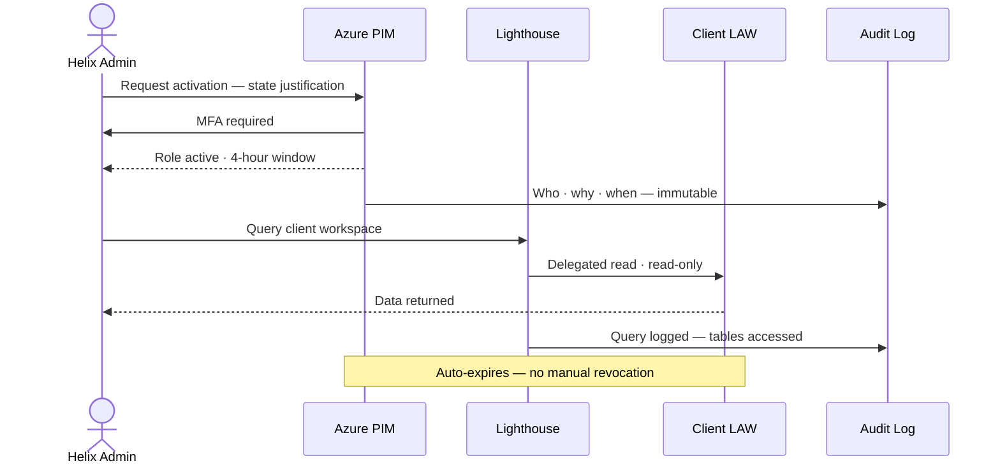
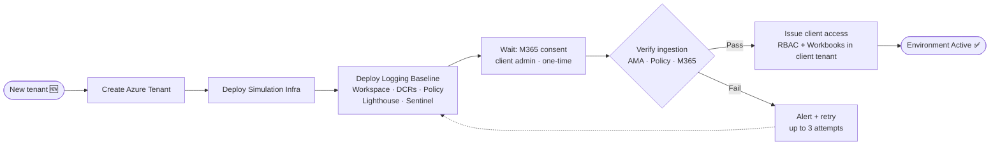
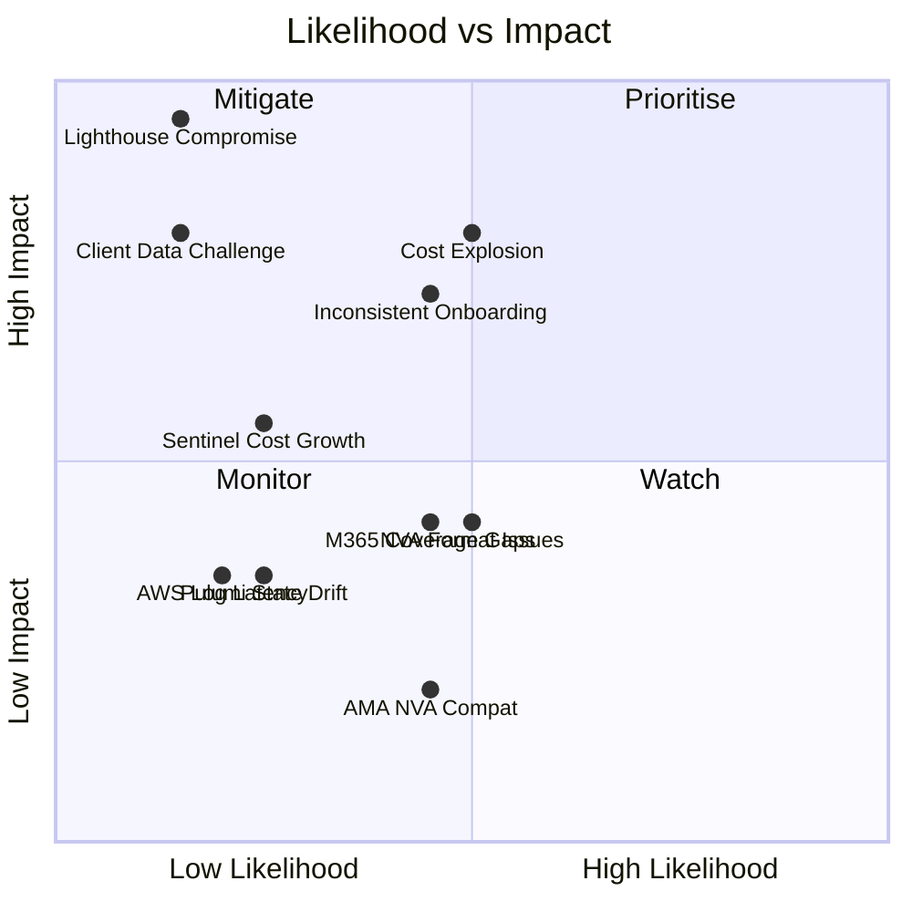

<!-- _class: title -->
<!-- _paginate: false -->

# 🔐 Helix
## Logging Platform Architecture Proposal

*Cross-tenant telemetry · Zero standing access · Automated at scale*

---

<!-- _class: statement -->

## Before this is a logging problem —
## it's a **cross-tenant trust problem**

*N isolated client tenants · separate Entra directories · three different audiences*

<!--
TALKING POINTS
- Resist the urge to open with "we're going to talk about logging"
- The hard part isn't collecting logs — it's the topology
- Each client is a completely separate Azure Entra directory
- Any solution that ignores this either leaks data between clients, or requires permanent privileged access to every tenant
- Both are non-starters for a cybersecurity platform
- Set up why federated is the obvious answer before showing a diagram
-->

---

<!-- _header: The Problem -->

# 📡 Three sources. Three audiences. One constraint.

 

| Sources | Audiences |
|---|---|
| Shared AWS — Cloudflare · Django · Containers | **Developers** — platform debugging only |
| Shared Azure — Simulation Engine · Entra · ACA | **IT Admins / Security** — cross-env visibility |
| Client tenants — Windows · Linux · NVA · M365 | **Clients** — their own data only |

 

> These three audiences must **never share the same access boundary**

<!--
TALKING POINTS
- Three structurally different source types — each needs a different collection path
- Three audiences with completely different access needs
- Developers must not see client security events
- Clients must not see each other's data
- Admins need cross-env visibility but with accountability for every query
- The access separation is not optional — it's the design constraint everything else serves
-->

---

<!-- _header: Architecture -->

# 🏗️ Architecture Overview

<!--
TALKING POINTS
- Walk left to right — sources, collection, storage, access
- Two separate storage destinations: Shared LAW for Helix-owned stuff, per-client LAW for client data
- The dotted line is the most important: Sentinel QUERIES OUT — data never physically moves into Helix's tenant
- Client logs stay in the client's Azure environment, always
- Pause here for initial questions — people will have them
-->

---

<!-- _class: principle -->

# Collect locally
# Govern centrally
# **Access selectively**

<!--
TALKING POINTS
- This is the design stance in one line — say it out loud
- Collect locally = data never leaves the tenant it belongs to
- Govern centrally = one Sentinel, one Workbook layer, one place to manage rules and alerts
- Access selectively = JIT elevation, time-limited, every query audited
- Every architecture decision flows from this principle
- If you forget everything else, remember this
-->

---

<!-- _header: Architecture -->

# 🎯 Five decisions that drive everything

| Decision | Choice | Wrong choice costs you |
|---|---|---|
| Collection model | **Federated** — logs stay in tenant | One credential breach → all clients exposed |
| Workspace topology | **One LAW per client** | RBAC gap leaks data across clients |
| Cross-tenant access | **Lighthouse + PIM/JIT** — no standing privilege | Blast radius that never closes |
| IaC pattern | **Pulumi ComponentResource** — baseline as a class | Silent drift by client 10 |
| Log classification | **Three tiers** — Analytics · Basic · Archive | Paying Sentinel prices for debug noise |

<!--
TALKING POINTS
- Read the left column only — the decisions
- For each: say the choice, then what the wrong choice costs
- These are load-bearing — change any one and the architecture changes materially
- The rest of the presentation is justification for each of these
- Don't dwell here — this is a map, not the territory
-->

---

<!-- _header: Security -->

# 🚧 Three trust boundaries

<!--
TALKING POINTS
- Boundary 1: Helix's own tenant — standard Azure RBAC, least privilege, PIM for privileged roles
- Boundary 2: The high-risk one — cross-tenant. Lighthouse + PIM is the only crossing point
- Boundary 3: Inside each client tenant — Pulumi-deployed DCRs, AMA, NSG rules, consistent baseline
- The architecture is designed so Boundary 2 is the only place where identity risk concentrates
- And we've minimised that risk deliberately
-->

---

<!-- _header: Security -->

# ⏱️ How cross-tenant access actually works

<!--
TALKING POINTS
- No standing access — every single query requires this flow
- MFA at activation, not just at login
- Every activation AND every query is logged immutably
- The 4-hour window is the default — configurable per policy
- Access auto-expires, nothing to forget to revoke
- Pre-activate at shift start if you're expecting a live incident
- Full chain of custody in both Helix and client Entra audit logs
-->

---

<!-- _class: warning-slide -->
<!-- _header: Security — Honest Assessment -->

# ⚠️ Blast radius — honest

 

**Worst case:** credential compromised + MFA bypassed

 

| What they can do | What they cannot do |
|---|---|
| Read all clients' log data | Modify or delete any data |
| For up to **4 hours** | Access compute, network, identity |
| Fully audited | Extend beyond the PIM window |

 

> Compare to centralised: **unlimited · permanent · no audit · no expiry**

<!--
TALKING POINTS
- Don't hide this — say it clearly and frame it correctly
- The blast radius is: all clients' log data, read-only, 4 hours, fully audited
- That's the design — bounded by construction, not by luck
- The comparison is what matters: centralised model has no time limit, no per-client isolation, no automatic expiry
- Federated is the harder operational model and the materially safer breach model
- This is why we pay the 15% workspace cost premium
-->

---

<!-- _header: Automation -->

# 🚀 Onboarding — one command, one baseline

<!--
TALKING POINTS
- Every client gets the same baseline through the same code path
- No manual steps — no portal clicks, no per-client configuration
- M365 consent is the one human step — client's Global Admin must click approve — workflow dispatches the URL and waits up to 48 hours
- Verification gate: AMA heartbeat + Policy compliance + M365 connector active
- If verification fails: 3 retries with backoff, then platform team is paged
- The environment is not released until logging is verified
-->

---

<!-- _header: Automation -->

# 🤖 Temporal — not just another pipeline

 

### GitHub Actions
*Delivery pipeline*

- Triggered by repo events
- Short-lived jobs
- Re-run if it fails
- Great for: build · test · deploy

### Temporal
*Durable orchestration*

- Triggered by platform events
- Survives restarts · crashes
- Resumes from last state
- Great for: provision · wait · retry over days

 

> M365 consent can wait **48 hours** — that's not a CI/CD job

<!--
TALKING POINTS
- Both are called "workflows" — very different problems
- GitHub Actions: repo event automation, ephemeral, pipeline thinking
- Temporal: durable stateful processes, resumes after crash, wait for external signals
- The onboarding process has a 48-hour wait built in (M365 consent)
- Retries can span hours. Workers can restart mid-provisioning.
- GitHub Actions is wrong tool for this. Temporal is the right one.
- We use GitHub Actions for CI/CD (Pulumi deployments, drift checks) — correct use
-->

---

<!-- _header: Cost Model -->

# 💰 Not all logs are equal

 

| Tier | Cost | Retention | Use for |
|---|---|---|---|
| **Analytics** | ~$2.30 / GB | 90 days hot | Security events · audit logs · product events |
| **Basic** | ~$0.50 / GB | 8 days hot | Verbose app logs · container output · debug traces |
| **Archive** | ~$0.02 / GB / mo | Up to 12 years | Compliance retention · historical forensics |

 

> **DCR transformations** route at ingestion — filtered data is never stored, never charged

<!--
TALKING POINTS
- Default flat ingestion = paying Analytics prices for everything, including debug noise nobody queries
- DCR transforms route before data lands — most cost-effective lever available
- Security events: Analytics. Container stdout: Basic. Old compliance data: Archive.
- 80% cost reduction per GB moving from Analytics to Basic
- Archive at $0.02/GB is effectively free for compliance retention
-->

---

<!-- _header: Cost Model -->

# ⚖️ Isolated vs shared — the numbers

 

**10 clients · 10 GB/day each · approx. USD**

| | Log Analytics | Sentinel | **Monthly total** |
|---|---|---|---|
| 10 isolated workspaces | ~$6,900 | ~$7,380 | **~$14,280** |
| 1 shared workspace | ~$5,880 | ~$6,300 | **~$12,180** |
| Difference | | | **~$2,100 / month (+15%)** |

 

**What the 15% buys:**
- Data never co-located across clients
- Bounded blast radius if credential compromised
- Clean per-client audit trail
- Per-client retention policies

<!--
TALKING POINTS
- The cost difference is real — don't pretend it isn't
- Roughly $2,100/month at 10 clients
- But frame what it buys: data residency, bounded blast radius, clean audit, flexible retention
- For any regulated client (defence, government, financial services) — isolated workspaces are likely non-negotiable regardless of cost
- Shared workspace remains a viable lower-cost tier option for clients where isolation is a preference, not a hard requirement
- The billing lands in each client's Azure subscription — if Helix manages those subscriptions, it flows through service pricing
-->

---

<!-- _header: Team Impact -->

# 👥 What changes for each team

| Team | They gain | Upfront ask |
|---|---|---|
| **Infrastructure** | Repeatable onboarding pattern — one Pulumi run per client | Workspace topology decisions at design time |
| **DevOps** | Policy self-heals coverage gaps — no manual tracking | Build the Pulumi component · DCRs · Sentinel rule library |
| **Security — Blue** 🔵 | Full audit trail · Sentinel across all clients · JIT access | PIM activation adds 2–5 min to first query |
| **Security — Red** 🔴 | Consistent telemetry — gaps visible via Policy compliance | Validate detection coverage per client onboarding |
| **Business / Finance** | Per-client cost attribution via tags | Agree billing model at onboarding contract |
| **Operations** | Single Workbook layer across all clients | Maintain query packs · alert triage runbooks |
| **Software Dev** | Structured traces without elevated cloud permissions | Integrate OTel SDK into Django + Temporal workers |

<!--
TALKING POINTS
- Don't read the table — scan the "They gain" column, let each team self-identify
- Then call out the upfront asks explicitly — don't hide them
- DevOps: several engineering weeks before first client onboarded — one-time investment
- Blue team: PIM latency is a deliberate trade-off, not a bug — pre-activate at shift start
- Software Dev: OTel integration is real code, not a config toggle — one-time, ongoing as new services added
- Give each team space to respond here — this is where conversation happens
-->

---

<!-- _header: Risks -->

# ⚠️ Risk landscape

<!--
TALKING POINTS
- Lighthouse compromise sits top-left: low probability, critical impact — deliberate placement
- The mitigations (PIM/JIT, scoped delegation, hardened managing tenant) are designed to keep it there
- Cost explosion and inconsistent onboarding are the medium-probability risks — both directly addressed by the architecture
- M365 coverage gaps and NVA format issues are medium probability, medium impact — documented and mitigated
- Key message: we know where the risks are, we've designed for them, the residual is acceptable
-->

---

<!-- _header: Risks -->

# 🛡️ Residual risk — acceptable by design

 

| Concern | Federated (this proposal) | Centralised (alternative) |
|---|---|---|
| Credential compromise | Read-only · all clients · **4 hours** | Read-only · all clients · **unlimited** |
| Data residency breach | Client data stays in client tenant | All clients co-located |
| Blast radius | Bounded by PIM window + scope | Unbounded |
| Audit trail | Immutable · per-client | Commingled |

 

> The federated model is the harder operational posture and the **materially safer breach posture**

<!--
TALKING POINTS
- The residual risk profile is acceptable for a cybersecurity simulation platform
- The dominant risks — Lighthouse blast radius, cost explosion — are both mitigated below equivalent risks in the alternative architectures
- Close by naming the trade-off honestly: operational complexity is higher, breach containment is significantly better
- Then hand it to the room — "What questions does the team have?"
-->

---

<!-- _class: statement -->
<!-- _paginate: false -->

## Centralise **control**.
## Centralise **visibility**.
## Never centralise **risk**.

*Full proposal · diagrams · implementation detail → github.com/danielcorrea89/helix-logging-proposal*

<!--
TALKING POINTS
- End on the design principle, not on a risk slide
- Invite questions — don't rush to close
- Have the docs open in browser tabs for any deep dives
- The proposal is all on GitHub — they can read it after the call
-->
