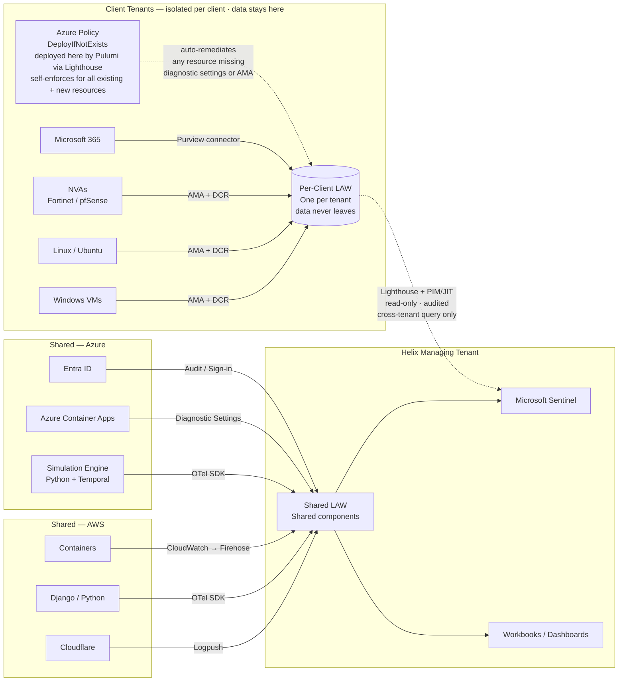

# Helix — Logging Platform Architecture Proposal

**Submitted by:** Daniel Correa &nbsp;|&nbsp; **Date:** April 2026 &nbsp;|&nbsp; **Brief:** [Azure Candidate Assignment](assignment/helix-technical-assignment.pdf)

---

## Executive Summary

Helix's platform spans shared AWS and Azure infrastructure alongside N isolated per-client Azure tenants. The logging challenge here is not primarily a tooling question — it is a **cross-tenant identity and data governance problem**. A solution that solves collection without solving trust boundaries creates security and operational debt that compounds with every client onboarded.

This proposal recommends a **federated collection model with centralised governance**: logs are collected close to their source under tenant-appropriate controls, while Helix's platform team retains authorised, auditable visibility across all environments through carefully scoped delegation. Collection, storage, access, and automation are treated as separate concerns — each composable and replaceable independently.

> **Design stance:** Centralise observability *control* and *search experience* where it makes sense. Do not centralise *risk* blindly. Collect locally, govern centrally, access selectively.

---

## Architecture Overview

---

## Key Design Decisions

| Decision | Choice | Rationale |
|---|---|---|
| Collection model | Federated — local per client tenant | Preserves tenant isolation, minimises cross-tenant data movement |
| Workspace topology | One Log Analytics Workspace per client | Defensible data boundary; supports per-client retention and RBAC |
| Cross-tenant access | Azure Lighthouse + PIM/JIT | No standing privilege; all access delegated, time-limited, and audited |
| IaC tooling | Pulumi — Python | Reusable `ComponentResource` classes drive repeatable client onboarding |
| Log classification | Three tiers: Analytics / Basic / Archive | Cost matched to access frequency; scale to zero at zero ingestion |

---

## Navigation

| # | Section | What it covers |
|---|---|---|
| 1 | [Requirements](docs/01-requirements.md) | Problem interpretation, personas, success criteria as design constraints |
| 2 | [Options](docs/02-options.md) | Three architectural options with trade-off analysis and comparison |
| 3 | [Recommended Architecture](docs/03-architecture.md) | Ingestion paths, workspace topology, access model, technology choices |
| 4 | [Security Controls](docs/04-security.md) | Lighthouse blast radius, PIM/JIT, identity model, policy enforcement |
| 5 | [Team Impact](docs/05-team-impact.md) | Impact across Infrastructure, DevOps, Security, Business, Ops, Software Dev |
| 6 | [Cost Model](docs/06-cost-model.md) | Log tiers, per-client cost attribution, scale economics |
| 7 | [Automation](docs/07-automation.md) | Pulumi Python classes, onboarding pipeline, policy-as-code |
| 8 | [Risks & Mitigations](docs/08-risks.md) | Risk register with likelihood, impact, and mitigation per risk |
