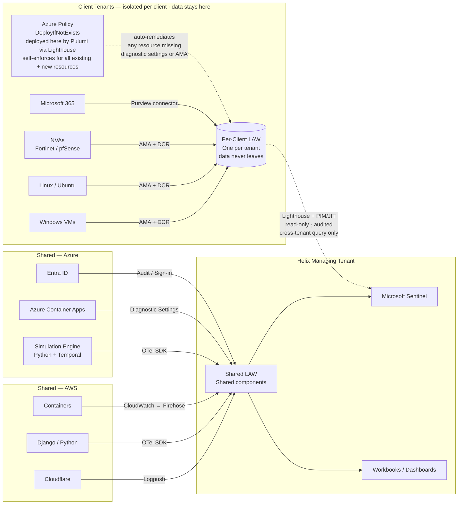
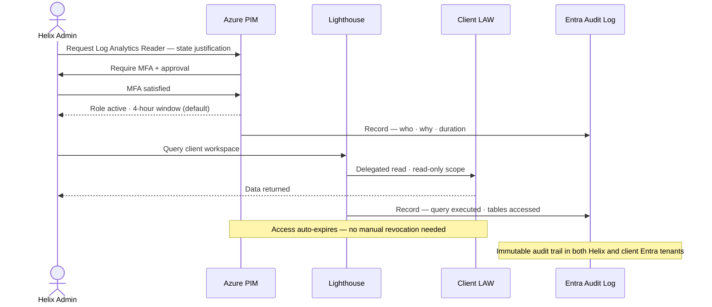
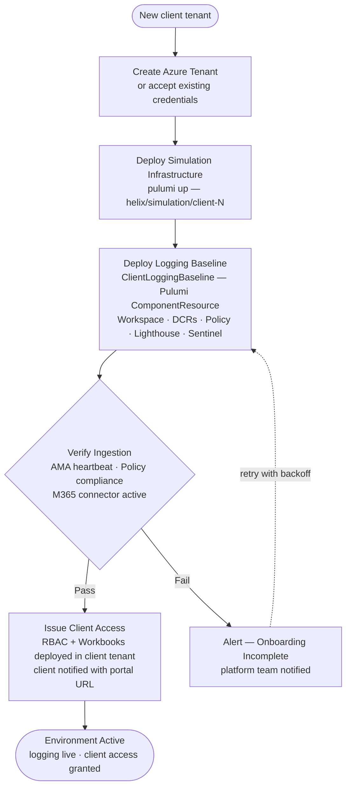

# Helix — Logging Platform Architecture Proposal

**Created by:** Daniel Correa &nbsp;|&nbsp; **Date:** April 2026 &nbsp;

---

Helix's platform spans shared AWS and Azure infrastructure alongside N isolated per-client Azure tenants. Before this is a logging problem, it is a **cross-tenant identity and trust problem**. A solution that collects everything without designing trust boundaries first creates security debt that compounds with every client onboarded.

This proposal recommends a **federated collection model with centralised governance**: logs are collected and stored inside each client's own Entra boundary; Helix retains authorised, auditable visibility across all environments through carefully scoped, time-limited delegation. Three alternatives were evaluated — the recommendation and the reasoning behind it are in [Options](docs/02-options.md).

> [!IMPORTANT]
> **Design stance** — Centralise observability *control* and *search experience*. Do not centralise *risk*. Collect locally, govern centrally, access selectively.

---

## Architecture Overview



---

## Five Decisions That Drive Everything

| Decision | Choice | The wrong choice costs you |
|---|---|---|
| **Collection model** | Federated — logs stay in each tenant | Centralising raw data means one compromised Helix credential exposes every client simultaneously |
| **Workspace topology** | One Log Analytics Workspace per client | A shared workspace with misconfigured RBAC leaks one client's security events to another |
| **Cross-tenant access** | Azure Lighthouse + PIM/JIT — no standing privilege | Permanent cross-tenant admin access is a blast radius that never closes |
| **IaC pattern** | Pulumi Python `ComponentResource` — client baseline as a class | Copy-paste configs drift silently; by client 10 every environment is slightly different |
| **Log classification** | Three tiers: Analytics · Basic · Archive | Flat ingestion means paying Sentinel-tier prices for debug output nobody ever queries |

---

## Security at the Cross-Tenant Boundary

The most important security property of this architecture is that **no Helix user has standing read access to any client workspace**. Every cross-tenant query is JIT-elevated, time-limited, and fully audited.



> [!WARNING]
> **Lighthouse blast radius is bounded by design.** A compromised Helix credential that also bypasses MFA can read all clients' log data for at most 4 hours. It cannot modify data, access resources outside Log Analytics, or escalate beyond the delegated read scope. This is the primary reason the architecture uses federated workspaces rather than a shared central store — the wrong model turns a credential compromise into a full data breach across every client with no time limit and no audit trail.

---

## Onboarding a New Client

Every client environment gets the same logging baseline through the same code path. There are no manual steps.



> [!NOTE]
> The logging baseline is a step in the existing **Temporal** orchestration workflow — not a separate manual process. Every environment that exists has a logging baseline. There is no path to a running simulation without one.

```python
baseline = ClientLoggingBaseline(
    client_id="acme-corp",
    config=ClientConfig(
        subscription_id="...",
        location="australiaeast",
        tier="standard",        # or "high-sensitivity" for Private Link + extended detection rules
        vm_resource_ids=[...],
        m365_tenant_id="...",
    )
)
```

---

## Explore the Full Proposal

| # | Section | What it covers |
|---|---|---|
| 1 | [Requirements](docs/01-requirements.md) | Problem decomposition, personas, success criteria as design constraints, assumptions |
| 2 | [Options](docs/02-options.md) | Three architectural options with data-flow diagrams, comparison matrix, recommendation |
| 3 | [Architecture](docs/03-architecture.md) | Ingestion paths per source, workspace topology, access model, technology choices |
| 4 | [Security Controls](docs/04-security.md) | Trust boundaries, Lighthouse blast radius, PIM/JIT, pipeline identity model, Policy enforcement |
| 5 | [Team Impact](docs/05-team-impact.md) | Layer ownership, impact narrative across Infrastructure, DevOps, Security, Business, Ops, Dev |
| 6 | [Cost Model](docs/06-cost-model.md) | Log tier routing, per-client attribution, isolated vs shared comparison, scale-to-zero |
| 7 | [Automation](docs/07-automation.md) | Pulumi ComponentResource pattern, Temporal integration, policy-as-code, drift detection |
| 8 | [Risks & Mitigations](docs/08-risks.md) | Risk matrix, register, Lighthouse blast radius deep dive, residual risk acceptance |
