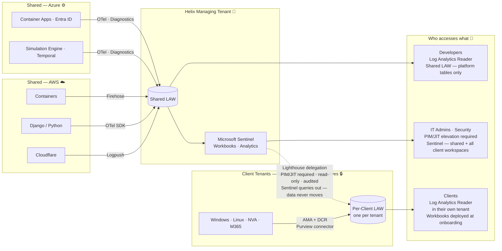
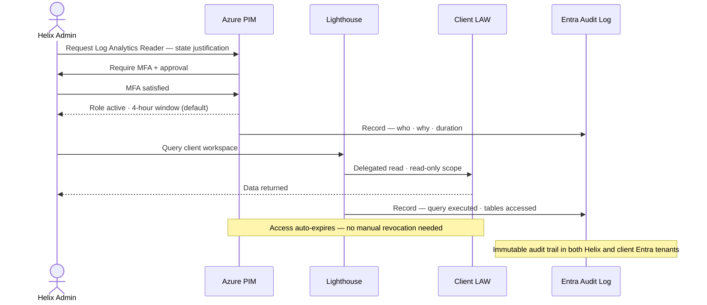
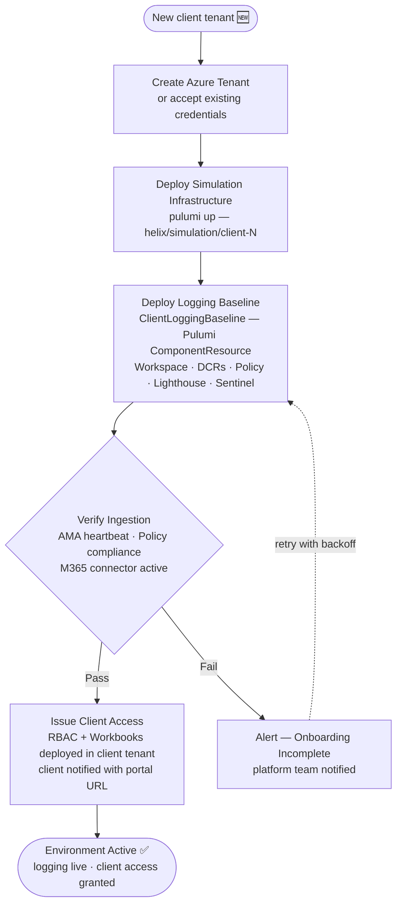

# 🔐 Helix — Logging Platform Architecture Proposal

> End-to-end **Azure logging platform** for a multi-tenant cybersecurity simulation company.
> Designed around **federated collection, centralised governance, and zero standing access** across isolated client environments.

---

## 🔍 The Problem

Helix's platform spans shared AWS and Azure infrastructure alongside N isolated per-client Azure tenants. Before this is a logging problem, it is a **cross-tenant identity and trust problem**. A solution that collects everything without designing trust boundaries first creates security debt that compounds with every client onboarded.

This proposal recommends a **federated collection model with centralised governance**: logs are collected and stored inside each client's own Entra boundary; Helix retains authorised, auditable visibility across all environments through carefully scoped, time-limited delegation. Three alternatives were evaluated — the recommendation and the reasoning behind it are in [Options](docs/02-options.md).

> [!IMPORTANT]
> **Design stance** — Centralise observability *control* and *search experience*. Do not centralise *risk*. Collect locally, govern centrally, access selectively.

---

## 🏗️ Architecture Overview

---

## ✅ How This Addresses Each Requirement

| Requirement | Technology chosen | How |
|---|---|---|
| **All key systems captured** | Azure Monitor Agent, DCRs, OTel SDK, Cloudflare Logpush, Purview connector, Azure Policy | Dedicated ingestion path per source type; Azure Policy auto-deploys collection to new resources without manual intervention |
| **Least privilege access** | Azure Lighthouse, Azure PIM/JIT, per-workspace RBAC | No standing cross-tenant access; JIT elevation required for every admin query; each persona scoped to only their data |
| **Not cumbersome for admins** | Microsoft Sentinel, Azure Workbooks, cross-workspace KQL | Single Sentinel instance surfaces all environments; no per-tenant portal login; standardised query packs cover common investigations |
| **Automated, maintainable by a small team** | Pulumi (Python), Temporal, Azure Policy | Client baseline is one Pulumi component instantiation; Policy self-heals coverage gaps; logging is a mandatory workflow step — never skipped |
| **Flexible and scalable** | Pulumi ComponentResource, Azure Policy, Azure Container Apps (scale-to-zero) | Adding a client is a Pulumi run; Policy covers new resources automatically; idle environments cost near-zero — ACA scales containers down to zero when no simulation is running |
| **Cost effective** | Log Analytics tiers (Analytics / Basic / Archive), DCR transformations | Logs routed to cheapest appropriate tier at ingestion; security events in Analytics, verbose logs in Basic |

---

## 🎯 Five Decisions That Drive Everything

| Decision | Choice | Chosen over | The wrong choice costs you |
|---|---|---|---|
| **Collection model** | Federated — logs stay in each tenant | Fully centralised in Helix's tenant; security-only hybrid | Centralising raw data means a Helix credential compromise exposes every client's raw data with no time bound, no per-client isolation, and no client-side revocation |
| **Workspace topology** | One Log Analytics Workspace per client | Shared workspace with resource-context RBAC | A shared workspace with misconfigured RBAC leaks one client's security events to another |
| **Cross-tenant access** | Azure Lighthouse + PIM/JIT — no standing privilege | Guest accounts (B2B) per admin × tenant; service principal per client tenant | Permanent cross-tenant admin access is a blast radius that never closes |
| **IaC pattern** | Pulumi Python `ComponentResource` — client baseline as a class | Terraform HCL; Bicep/ARM | Copy-paste configs drift silently; by client 10 every environment is slightly different |
| **Log classification** | Three tiers: Analytics · Basic · Archive | Flat single-tier ingestion | Flat ingestion means paying Sentinel-tier prices for debug output nobody ever queries |

> Full per-decision rationale — alternatives considered, cost shape, operational impact, trade-offs accepted, when each choice would be revisited — is in [Decisions](docs/09-decisions.md).

---

## 🛡️ Security at the Cross-Tenant Boundary

The most important security property of this architecture is that **no Helix user has standing read access to any client workspace**. Every cross-tenant query is JIT-elevated, time-limited, and fully audited.

> [!WARNING]
> **Lighthouse blast radius is bounded by design.** If a Helix credential is compromised and MFA bypassed, the intended blast radius is read-only access within the active PIM window — assuming Lighthouse delegation is correctly scoped and no additional standing permissions exist. It cannot modify data, access resources outside Log Analytics, or persist beyond the PIM window without a new activation. This is the primary reason the architecture uses federated workspaces rather than a shared central store — the wrong model turns a credential compromise into a full data breach across every client with no time limit, no per-client isolation, and no audit trail.

---

## 🚀 Onboarding a New Client

Every client environment gets the same logging baseline through the same code path. There are no manual steps.

> [!NOTE]
> Logging is not a separate onboarding task — it is a mandatory step in the same automated workflow that provisions the simulation environment. A client environment cannot be marked ready without a verified logging baseline. See [Automation](docs/07-automation.md) for the implementation detail.

---

## 📚 Explore the Full Proposal

| # | Section | What it covers |
|---|---|---|
| 1 | [Requirements](docs/01-requirements.md) | Problem decomposition, data sources, personas, success criteria, product event data scope boundary, discovery questions, assumptions |
| 2 | [Options](docs/02-options.md) | Three architectural options with data-flow diagrams, trade-off comparison, recommendation |
| 3 | [Architecture](docs/03-architecture.md) | Ingestion paths per source, workspace topology, access model, client access experience, technology choices |
| 4 | [Security Controls](docs/04-security.md) | Trust boundaries, Lighthouse blast radius, PIM/JIT, pipeline identity, Policy enforcement, high-sensitivity tier |
| 5 | [Team Impact](docs/05-team-impact.md) | Per-team impact and ownership, open decisions required from the team, discussion points |
| 6 | [Cost Model](docs/06-cost-model.md) | Log tier routing, billing ownership, isolated vs shared comparison, per-client attribution, scale-to-zero |
| 7 | [Automation](docs/07-automation.md) | Pulumi pattern, Temporal vs GitHub Actions, onboarding pipeline, policy-as-code, self-monitoring, drift detection |
| 8 | [Risks & Mitigations](docs/08-risks.md) | Risk matrix, register, Lighthouse blast radius deep dive, risk acceptance, disaster recovery |
| 9 | [Decisions](docs/09-decisions.md) | Per-technology rationale: alternatives considered, why-not, cost shape, operational impact, trade-offs accepted, when to revisit |
| — | [Implementation Appendix](docs/appendix.md) | Pulumi component code, Temporal activity detail, pipeline identity model — low-level reference |
| — | [Presentation Slides](PRESENTATION-SLIDES.md) | Marp-formatted slide deck — condensed walkthrough of the proposal for the team-decision session |
