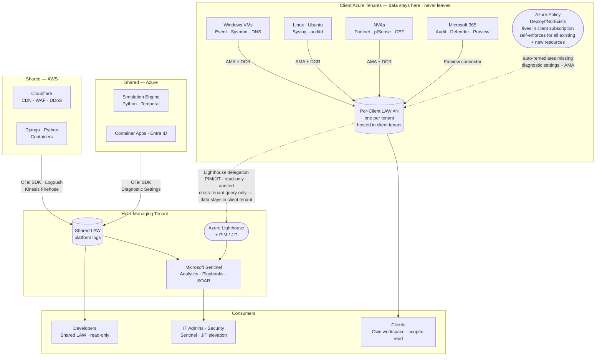
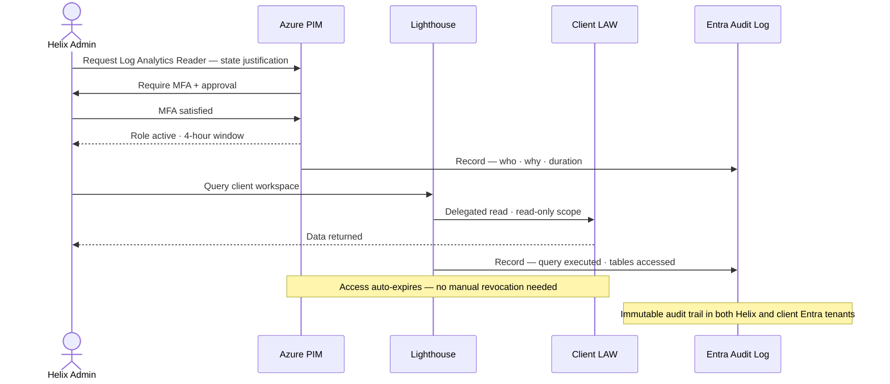
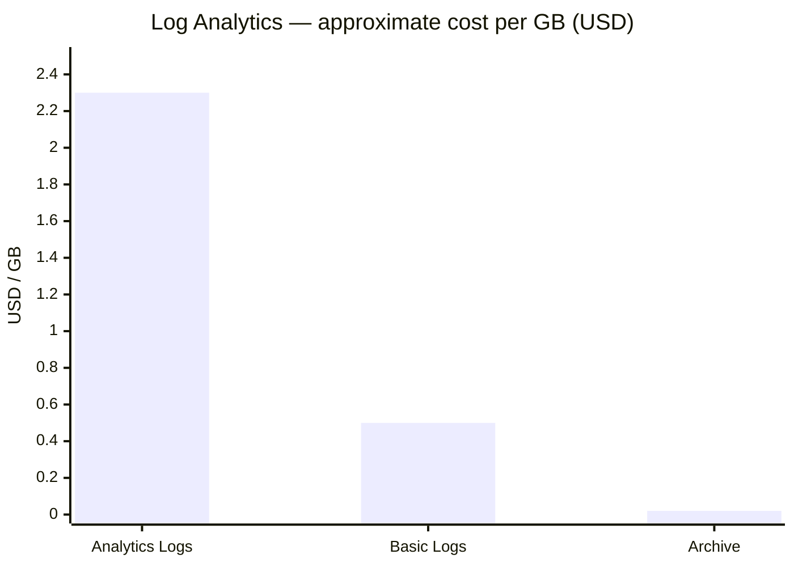
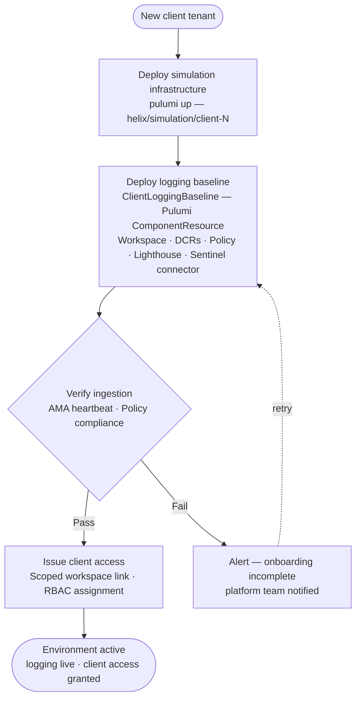

# Helix — Logging Platform Architecture

**Daniel Correa &nbsp;·&nbsp; April 2026**

---

Helix's platform spans shared AWS and Azure infrastructure alongside N isolated per-client Azure tenants. Before this is a logging problem, it is a **cross-tenant identity and trust problem**. A solution that collects everything without designing trust boundaries first creates security debt that compounds with every client onboarded.

> [!IMPORTANT]
> **Design stance** — Centralise observability *control* and *search experience*. Do not centralise *risk*. Collect locally, govern centrally, access selectively.

---

## Architecture Overview



---

## Five Decisions That Drive Everything

| Decision | Choice | The wrong choice costs you |
|---|---|---|
| **Collection model** | Federated — logs stay in each tenant | Centralising raw data means one compromised Helix credential exposes every client simultaneously |
| **Workspace topology** | One Log Analytics Workspace per client | A shared workspace with misconfigured RBAC leaks one client's security events to another |
| **Cross-tenant access** | Azure Lighthouse + PIM/JIT — no standing privilege | Permanent cross-tenant admin access is a blast radius that never closes |
| **IaC pattern** | Pulumi Python `ComponentResource` — client baseline as a class | Copy-paste configs drift silently; by client 10 every environment is slightly different |
| **Log classification** | Three tiers: Analytics · Basic · Archive | Flat ingestion means paying Sentinel-tier prices for debug output nobody ever queries |

---

## Security at the Cross-Tenant Boundary

The most important security property of this architecture is that **no Helix user has standing read access to any client workspace**. Every cross-tenant query is JIT-elevated, time-limited, and fully audited.



> [!WARNING]
> **Lighthouse blast radius is bounded by design.** A compromised Helix credential can read one client's workspace for at most 4 hours. It cannot modify data, access other clients, or escalate beyond the delegated read scope. This is the primary reason the architecture uses federated workspaces rather than a shared central store — the wrong model turns a credential compromise into a full data breach across every client simultaneously.

---

## What It Costs

Not all logs have equal value. DCR transformation rules classify and route at ingestion — before data touches any table.



| Tier | What goes here | Retention | Approx. cost |
|---|---|---|---|
| **Analytics** | Security events · M365 audit · Entra sign-ins · NVA deny · Cloudflare WAF | 90 days hot | ~$2.30/GB |
| **Basic** | App logs · container stdout · verbose syslog · Cloudflare access | 8 days hot | ~$0.50/GB |
| **Archive** | Everything after hot retention expires | Up to 12 years | ~$0.02/GB/month |

> [!TIP]
> **Scale to zero is built in.** When a client simulation environment is not running — VMs deallocated, ACA scaled to zero — ingestion cost drops to zero automatically. DCRs collect nothing when there is nothing to collect. Archive storage is the only cost that persists, at ~$0.02/GB/month.

**Isolated vs shared workspace cost** — the isolation model costs approximately 15% more at 10 clients. For clients in security or defence, that premium is non-negotiable. For clients where it is contractually acceptable, a shared workspace with resource-context access control is a viable lower-cost option Helix can offer as a separate tier.

---

## Onboarding a New Client

Every client environment gets the same logging baseline through the same code path. There are no manual steps.



> [!NOTE]
> The logging baseline is a step in the existing **Temporal** orchestration workflow — not a separate manual process. Every environment that exists has a logging baseline. There is no path to a running simulation without one.

The `ClientLoggingBaseline` Pulumi component provisions the full baseline from a single instantiation:

```python
baseline = ClientLoggingBaseline(
    client_id="acme-corp",
    config=ClientConfig(
        subscription_id="...",
        location="australiaeast",
        tier="standard",        # or "high-sensitivity" for Private Link
        vm_resource_ids=[...],
        m365_tenant_id="...",
    )
)
```

One command. One consistent baseline. No drift.

---

## Explore the Full Proposal

| # | Section | What it covers |
|---|---|---|
| [01 — Requirements](docs/01-requirements.md) | Problem decomposition · personas · success criteria as design constraints · assumptions |
| [02 — Options](docs/02-options.md) | Three architectural options with data-flow diagrams · comparison matrix · recommendation |
| [03 — Architecture](docs/03-architecture.md) | Ingestion paths per source · workspace topology · access model · technology choices |
| [04 — Security](docs/04-security.md) | Trust boundaries · Lighthouse blast radius · PIM/JIT · pipeline identity model · Policy |
| [05 — Team Impact](docs/05-team-impact.md) | Layer ownership · impact narrative across Infrastructure · DevOps · Security · Business · Ops · Dev |
| [06 — Cost Model](docs/06-cost-model.md) | Log tier routing · per-client attribution · isolated vs shared comparison · scale-to-zero |
| [07 — Automation](docs/07-automation.md) | Pulumi ComponentResource pattern · Temporal integration · policy-as-code · drift detection |
| [08 — Risks](docs/08-risks.md) | Risk matrix · register · Lighthouse blast radius deep dive · residual risk acceptance |
