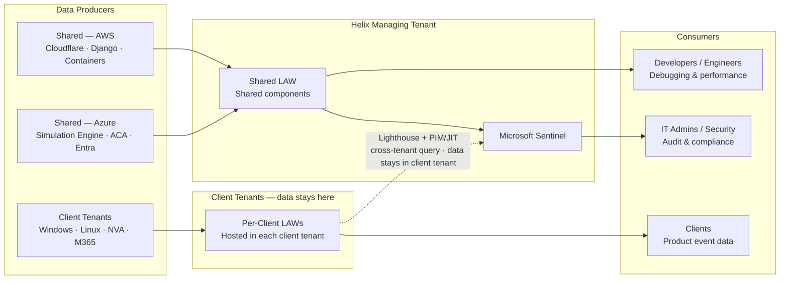

[← Home](../README.md)

# 1 — Requirements

## The Problem in Plain Language

Helix needs a logging platform that captures telemetry from three structurally different environments, serves three audiences with different needs, and does so in a way that a small team can automate, extend, and afford as the client base grows.

The brief is deceptively concise. The complexity is in the **topology**: shared infrastructure sits alongside N isolated client tenants, each in a separate Azure Entra directory. Any solution that treats this as a flat collection problem will either violate tenant isolation or require standing privileged access across every client — both unacceptable outcomes.

---

## At a Glance

> The three source types feed separate collection paths. The three consumer personas access different scopes of the platform — they never share an access boundary.

---

## Data Sources

### Shared Components — AWS
Helix's web-facing and application tier runs on AWS.

| Component | What it produces |
|---|---|
| Cloudflare | HTTP access logs, WAF events, DDoS signals, bot scores |
| Django / Python backend | Application logs, request traces, error events |
| Containers | Container stdout/stderr, health probes, resource metrics |

These are Helix-owned and Helix-operated. No cross-tenant trust is needed. The collection challenge is bridging AWS → Azure observability.

### Shared Components — Azure
The simulation orchestration and infrastructure layer runs on Azure, in Helix's own tenant.

| Component | What it produces |
|---|---|
| Simulation Engine (Python + Temporal) | Workflow execution events, task logs, simulation lifecycle events |
| Azure Container Apps | Container logs, HTTP request logs, scaling events |
| Entra ID | Sign-in logs, audit logs, RBAC change events, conditional access signals |
| Pulumi / GitHub | Deployment audit trail (out of scope for runtime logging — tracked separately) |

These are also Helix-owned. Native Azure Monitor integration applies throughout.

### Client Azure Tenants — Isolated, per client
Each client simulation environment is a dedicated Azure tenant. These are the most complex sources.

| Component | What it produces |
|---|---|
| Windows VMs | Windows Event Logs, Security events, Sysmon, DNS, authentication events |
| Linux / Ubuntu | Syslog, auth logs, auditd, process events |
| NVAs — Fortinet / pfSense | Firewall allow/deny, IPS alerts, VPN events, interface statistics |
| Microsoft 365 | Audit logs, sign-in events, mail flow, admin activity, Defender alerts |

These are in **separate Entra directories**. Collection requires cross-tenant access, which must be designed with care.

---

## Consumers and Their Needs

| Persona | Use case | What they actually need |
|---|---|---|
| **Clients** | Event data related to the product | Read access to their own simulation event logs — not raw platform internals, not other clients' data |
| **Developers / Engineers** | Platform debugging and performance | Application traces, container logs, error rates from shared components — without needing security-admin rights |
| **IT Admins / Security** | Audit, security, and compliance | Cross-environment visibility, security event correlation, audit trails for privileged actions — with appropriate elevation |

The key design implication: **these three personas must never share the same access boundary**. A developer debugging a Django error should not be able to read a client's Windows Security Event log.

---

## Success Criteria as Design Constraints

| Success Criterion | Design Constraint |
|---|---|
| Logs from all key systems captured | Ingestion path must exist for AWS, Azure, Windows, Linux, NVAs, and M365 — no source left dark |
| Least privilege access | RBAC scoped to persona, environment, and log category — no shared broad-access accounts |
| Not cumbersome for admins | Centralised search and dashboard experience — admins should not need to log into N different tenant portals |
| Automatable, maintainable by a small team | Onboarding a new client tenant must be a code path, not a manual project |
| Flexible and scalable | Architecture must support adding new client tenants without redesigning the platform |
| Cost effective | Log volume should not default to the most expensive tier — retention and ingestion must be tuned by log class |

---

## Assumptions

The following assumptions are made explicitly. A different answer to any of these would change specific implementation choices, not the overall architecture direction.

- **Workspace isolation:** Each client tenant's logs land in a dedicated Log Analytics Workspace. This is the safer default given the "isolated" language in the brief and the likely data handling expectations of security/defence clients. A shared workspace with resource-context access control is a viable cost-reduction option for clients where contractually acceptable.
- **Clients access their own logs directly:** The "Clients" persona implies paying clients have a scoped read path into their own event data — not mediated entirely by Helix staff.
- **Greenfield:** No existing SIEM or log aggregation assumed. The architecture is designed as a target state, not a migration.
- **Scale assumption for cost modelling:** 10–20 client tenants generating 5–20 GB/day each. Numbers are illustrative; the tiering model applies at any scale.
