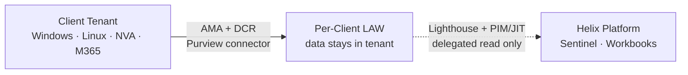
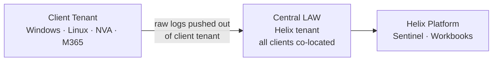
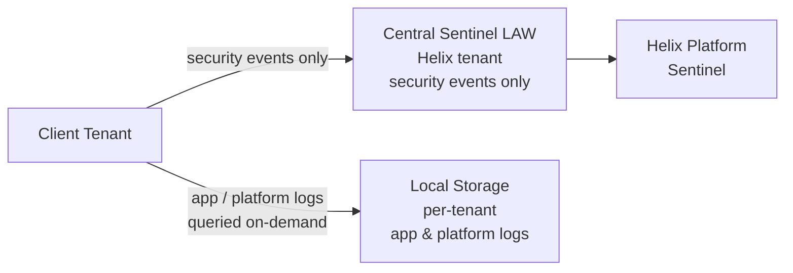

[← Home](../README.md) &nbsp;|&nbsp; [← Requirements](01-requirements.md) &nbsp;|&nbsp; Next: [Architecture →](03-architecture.md)

# 2 — Options

Three architecturally distinct approaches were considered. They differ primarily in **where logs are stored** and **how cross-tenant access is managed** — the two decisions that drive the most downstream consequences.

---

## Option A — Federated Collection with Centralised Governance (Recommended)

**Principle:** Collect at the source. Store per tenant. Govern and query centrally with controlled delegation.

### How it works

- Each client Azure tenant has a dedicated Log Analytics Workspace (LAW). All log collection within that tenant points to this workspace.
- Helix's shared AWS and Azure components send logs to a separate shared LAW in Helix's managing tenant.
- Helix admins access client workspaces via **Azure Lighthouse delegation** — a read-scoped, audited, time-limited path — rather than by creating accounts or SPNs inside each client tenant.
- Dashboards, alerting, and cross-tenant queries are served from Helix's managing tenant through this delegated access model.

### Architecture

```
Each client tenant:
  [Windows / Linux / NVA / M365]
        → AMA + DCR / Purview connector
        → Per-client LAW  (stays in client tenant)
              ↑
        Lighthouse delegation (read only, PIM-gated)
              ↓
Helix managing tenant:
  [Shared AWS logs + Shared Azure logs]
        → Shared LAW
        → Microsoft Sentinel (shared + delegated client visibility)
        → Workbooks / Dashboards (unified view)
```

### Data Flow



### Trade-offs

| | |
|---|---|
| **Strengths** | Tenant data stays in tenant; blast radius of a compromised Helix credential is read-only and scoped; supports different retention per client; least privilege by design; scales to N clients without architectural change |
| **Weaknesses** | Slightly more complex initial setup; cross-workspace KQL queries add a layer to troubleshooting; Lighthouse + PIM adds access latency (minutes, not seconds) for ad-hoc investigation |

---

## Option B — Fully Centralised

**Principle:** All logs flow into Helix-managed Log Analytics Workspaces. Client tenants push data out.

### How it works

- Log forwarding agents in each client tenant push logs to a central LAW (or set of shared LAWs) in Helix's tenant.
- Access control is managed at the workspace level using RBAC and table-level access.
- No Lighthouse required — all data is already in Helix's tenant.

### Data Flow



### Trade-offs

| | |
|---|---|
| **Strengths** | Simpler query experience (no cross-workspace joins); single location to monitor; easier to build shared alerting rules |
| **Weaknesses** | Raw client data leaves the client tenant — contractually and legally sensitive for security/defence clients; a breach of Helix's managing tenant exposes all clients' raw logs simultaneously; harder to enforce per-client data residency; table-level RBAC is less intuitive and more fragile than workspace-level isolation; more expensive at high client count (shared commitment tiers not necessarily better at low volume) |

### Why not recommended

The core issue is blast radius. If Helix's central workspace is compromised, an attacker has read access to every client's security events, authentication logs, and M365 audit trail simultaneously. For a cybersecurity platform whose clients are likely in security or defence, that concentration of sensitive data in a single store is architecturally inappropriate regardless of the access controls applied to it.

---

## Option C — Security-First Hybrid

**Principle:** Centralise only security and compliance events. Keep application and platform logs local.

### How it works

- Security-relevant events (Windows Security Event, Sysmon, M365 audit, NVA deny events) are forwarded to a central Sentinel-enabled workspace for correlation.
- Application and performance logs (container stdout, request traces, Django logs) stay in per-tenant or per-service workspaces.
- AWS shared logs go to a lightweight forwarding mechanism (e.g. S3 → Azure Blob) and are queried on-demand rather than streamed continuously.

### Data Flow



### Trade-offs

| | |
|---|---|
| **Strengths** | Lower cost (only high-value events centralised); smaller data footprint to protect centrally; faster query on security events; simpler for clients who have strict data residency requirements |
| **Weaknesses** | Operational logs and security logs become siloed — cross-correlating a performance issue with a security event requires jumping between stores; higher complexity in maintaining two different collection models; harder for developers to use a single pane |

### When this option is right

Option C is a strong cost-optimisation variant of Option A for mature deployments with well-understood log volumes. It is worth revisiting after Option A is running and Helix has a clear picture of which log categories are actually queried. Starting with Option C before that data exists risks under-collecting and missing signals.

---

## Comparison Matrix

| Criterion | Option A — Federated | Option B — Centralised | Option C — Security-First |
|---|---|---|---|
| Tenant data isolation | Strong | Weak | Strong |
| Blast radius if Helix credential compromised | Read-only, scoped | Full raw data exposure | Read-only, security events only |
| Admin query experience | Good — unified via Lighthouse | Best — single workspace | Fragmented — split stores |
| Onboarding automation | High — reusable Pulumi module | High | Medium — two models to maintain |
| Cost at 10 clients | Medium | Medium | Low |
| Cost at 50 clients | Lower (commitment tiers) | Lower (commitment tiers) | Lowest |
| Regulatory defensibility | High | Low–Medium | High |
| Small team maintainability | High | High | Medium |

---

## Recommendation

> [!IMPORTANT]
> **This proposal recommends Option A — Federated Collection with Centralised Governance.** The other options are documented to show the trade-offs considered, not as alternatives with equal standing.

Option A is the approach where tenant data boundaries hold even if Helix's central environment is compromised. For a cybersecurity platform whose clients are likely in security or defence, that property is difficult to compromise on — it underpins the trust model on which everything else is built.

Options B and C are documented for completeness and honesty:
- **Option B** (shared workspace) is a cost-reduction variant considered for clients where contractual isolation is a preference, not a requirement. It is not the default. The [Cost Model](06-cost-model.md) quantifies the trade-off explicitly.
- **Option C** (security-only centralisation) is a useful pattern *within* Option A — the log tiering strategy (Analytics / Basic / Archive) is Option C's selective centralisation applied at the table level, inside a federated model that preserves the isolation guarantee.

Neither B nor C is recommended as the primary architecture for this platform.

---

[← Requirements](01-requirements.md) &nbsp;|&nbsp; Next: [Architecture →](03-architecture.md)
