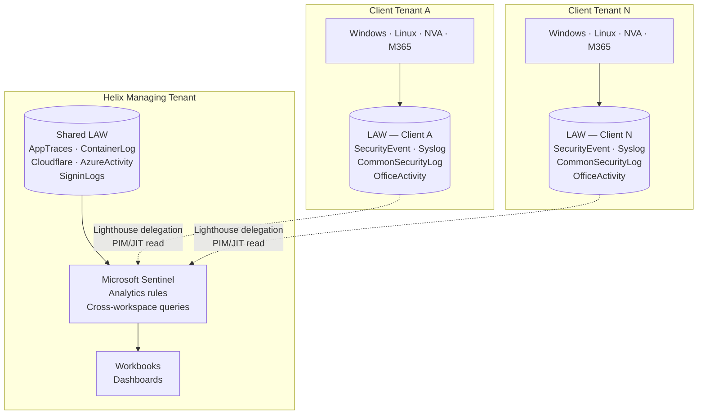

[← Home](../README.md)

# 3 — Recommended Architecture

## Overview

The architecture has four layers: **ingestion**, **storage**, **access**, and **governance**. Each is designed independently so that changes to one do not require redesigning the others.

---

## Ingestion — How Logs Reach the Platform

### AWS Shared Components

AWS does not have native Azure Monitor integration. Two paths are used depending on the source type:

**Application-level logs (Django, Python services):**
OpenTelemetry SDK is instrumented at the application layer. The OTel Collector running as a sidecar or standalone container exports directly to the **Azure Monitor Logs Ingestion API** (DCR-based). This gives near-real-time delivery and structured, schema-consistent log data without AWS-specific tooling.

**Infrastructure and platform logs (container runtime, CloudWatch metrics):**
AWS CloudWatch → Amazon Kinesis Data Firehose → Azure Blob Storage → Log Analytics DCR transformation pipeline. This path accepts latency (minutes, not seconds) and is appropriate for infrastructure telemetry that is not time-critical. Cost scales to zero when containers are not running.

**Cloudflare:**
Cloudflare Logpush streams access logs, WAF events, and bot scores directly to Azure Blob Storage or an HTTPS endpoint. A Log Analytics DCR processes the Logpush JSON format on ingestion. No agent required on any Helix host.

### Azure Shared Components

These are Helix-owned resources in Helix's managing tenant. Collection is native and simple.

| Source | Collection mechanism |
|---|---|
| Azure Container Apps (Simulation Engine) | Built-in diagnostics → Shared LAW. ACA scales to zero; log streams stop automatically — no idle cost |
| Temporal workflows | OTel SDK in Python workers → Azure Monitor Logs Ingestion API |
| Entra ID | Diagnostic Settings → Shared LAW (sign-in logs, audit logs, RBAC changes) |
| Azure platform (AKS, storage, network) | Diagnostic Settings → Shared LAW via Azure Policy enforcement |

### Client Azure Tenants

This is the most complex ingestion path. Each client tenant is a separate Entra directory. No agents or configurations are pre-installed — the Pulumi onboarding module provisions everything.

| Source | Collection mechanism | Destination |
|---|---|---|
| Windows VMs | Azure Monitor Agent (AMA) + Data Collection Rule (DCR) | Per-client LAW |
| Linux / Ubuntu | Azure Monitor Agent (AMA) + DCR | Per-client LAW |
| NVAs — Fortinet / pfSense | Syslog (CEF format) → Log Forwarder VM → AMA | Per-client LAW |
| Microsoft 365 | Microsoft Sentinel M365 Defender / Purview connector | Per-client LAW (Sentinel-enabled) |
| Azure resource diagnostics | Azure Policy — `DeployIfNotExists` diagnostic settings | Per-client LAW |

**NVA note:** Fortinet and pfSense both support CEF-format syslog output. A small Linux VM acts as the log forwarder — it receives syslog on UDP/514, normalises to CEF, and AMA forwards to the workspace. This is the standard pattern for network appliance log collection and avoids building custom parsers.

**M365 note:** The Microsoft Sentinel M365 connector ingests Unified Audit Log events, Defender for Office 365 alerts, and Entra sign-in/audit logs from the client's M365 tenant. This requires the client to grant delegated consent to Helix's Sentinel managed application — a one-time step during client onboarding.

---

## Storage — Workspace Topology

**One workspace per client. No client's raw data ever enters a workspace shared with another client.**

**One workspace per client tenant.** This is a deliberate choice. It keeps raw data inside the client's Entra boundary, makes RBAC straightforward, and means that a single compromised credential in Helix's managing tenant cannot expose all clients' raw security events simultaneously. See [Security Controls](04-security.md) for the Lighthouse access model.

---

## Access — Who Can Query What

Access paths are separated by persona. There is no shared admin account that spans all three.

| Persona | Access path | Scope | Mechanism |
|---|---|---|---|
| **Clients** | Direct LAW access | Their own workspace only | Azure RBAC — `Log Analytics Reader` scoped to their workspace; resource-context access control enabled |
| **Developers / Engineers** | Shared LAW | Shared platform tables only | `Log Analytics Reader` on Shared LAW; no access to client workspaces |
| **IT Admins / Security** | Shared LAW + Lighthouse-delegated client workspaces | All, with elevation | PIM-eligible `Log Analytics Reader` via Lighthouse; time-limited, approval-required, fully audited |

**Client access detail:** Clients receive a scoped link to their own workspace or a Helix-hosted Azure Workbook that queries only their workspace. They authenticate with their own Entra credentials (B2B guest or direct RBAC assignment). They cannot enumerate other workspaces.

**Admin access detail:** Helix admins do not have standing read access to client workspaces. Access is PIM-elevated on-demand, valid for a time window (e.g. 4 hours), and every query is recorded in the Lighthouse audit log in Helix's Entra tenant. See [Security Controls](04-security.md).

---

## Technology Choices and Rationale

| Technology | Role | Why chosen |
|---|---|---|
| Azure Monitor Log Analytics | Primary log store | Native Azure integration, commitment tier pricing, table-level RBAC, DCR transformations, Sentinel integration |
| Azure Monitor Agent (AMA) | Collection agent on VMs | Replaces legacy MMA/OMS agents; centrally configured via DCRs; supports Linux and Windows |
| Data Collection Rules (DCRs) | Ingestion configuration | Define what to collect, filter noise at source, transform on ingestion — reduces cost before data lands in the workspace |
| Microsoft Sentinel | SIEM / security analytics | Native integration with M365, Entra, and LAW; analytics rules and playbooks managed as code; avoids a third-party SIEM that adds integration overhead |
| Azure Lighthouse | Cross-tenant delegated access | Manages client tenants from Helix's tenant without creating accounts in each client — cleaner operating model, auditable, supports PIM |
| OpenTelemetry | Application instrumentation | Vendor-neutral; works across AWS and Azure; structured traces and logs with consistent schema; no vendor lock-in at the SDK layer |
| Cloudflare Logpush | WAF/CDN log collection | Native Cloudflare feature; no agent on Helix infrastructure; supports Azure Blob as destination |
| Pulumi — Python | IaC and onboarding automation | Reusable `ComponentResource` classes model the client logging baseline as a product; conditional logic and loops in real Python, not DSL workarounds |
| Azure Policy | Baseline enforcement | `DeployIfNotExists` and `AuditIfNotExists` enforce diagnostic settings and AMA deployment without manual intervention per resource |
