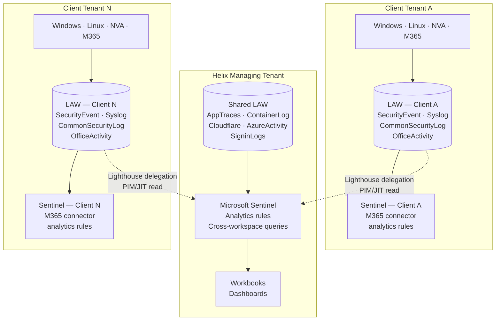

[← Home](../README.md) &nbsp;|&nbsp; [← Options](02-options.md) &nbsp;|&nbsp; Next: [Security Controls →](04-security.md)

# 3 — Recommended Architecture 🏗️

## 🗺️ Overview

The architecture has four layers: **ingestion**, **storage**, **access**, and **governance**. Each is designed independently so that changes to one do not require redesigning the others.

---

## 📥 Ingestion — How Logs Reach the Platform

### AWS Shared Components

AWS does not have native Azure Monitor integration. Two paths are used depending on the source type:

**Application-level logs (Django, Python services):**
OpenTelemetry SDK is instrumented at the application layer. The OTel Collector running as a sidecar or standalone container exports directly to the **Azure Monitor Logs Ingestion API** (DCR-based). This gives near-real-time delivery and structured, schema-consistent log data without AWS-specific tooling.

**Infrastructure and platform logs (container runtime, CloudWatch metrics):**
AWS CloudWatch → Amazon Kinesis Data Firehose → Azure Blob Storage → Log Analytics DCR transformation pipeline. This path accepts latency (minutes, not seconds) and is appropriate for infrastructure telemetry that is not time-critical. Cost scales to zero when containers are not running.

**Cloudflare:**
Cloudflare Logpush streams access logs, WAF events, and bot scores directly to Azure Blob Storage or an HTTPS endpoint. A Log Analytics DCR processes the Logpush JSON format on ingestion. No agent required on any Helix host.

### Azure Shared Components

These are Helix-owned resources in Helix's managing tenant. Collection is native and simple.

| Source | Collection mechanism |
|---|---|
| Azure Container Apps (Simulation Engine) | Built-in diagnostics → Shared LAW. ACA scales to zero; log streams stop automatically — no idle cost |
| Temporal workflows | OTel SDK in Python workers → Azure Monitor Logs Ingestion API |
| Entra ID | Diagnostic Settings → Shared LAW (sign-in logs, audit logs, RBAC changes) |
| Azure platform (AKS, storage, network) | Diagnostic Settings → Shared LAW via Azure Policy enforcement |

### Client Azure Tenants

This is the most complex ingestion path. Each client tenant is a separate Entra directory. No agents or configurations are pre-installed — the Pulumi onboarding module provisions everything.

| Source | Collection mechanism | Destination |
|---|---|---|
| Windows VMs | Azure Monitor Agent (AMA) + Data Collection Rule (DCR) | Per-client LAW |
| Linux / Ubuntu | Azure Monitor Agent (AMA) + DCR | Per-client LAW |
| NVAs — Fortinet / pfSense | Syslog (CEF format) → Log Forwarder VM → AMA | Per-client LAW |
| Microsoft 365 | Microsoft Sentinel M365 Defender / Purview connector | Per-client LAW |
| Azure resource diagnostics | Azure Policy — `DeployIfNotExists` diagnostic settings | Per-client LAW |

**NVA note:** Fortinet and pfSense both support CEF-format syslog output. A small Linux VM acts as the log forwarder — it receives syslog, normalises to CEF, and AMA forwards to the workspace. This is the standard pattern for network appliance log collection and avoids building custom parsers. Availability and redundancy of the forwarder VM is addressed in the [Implementation Appendix](appendix.md).

**M365 note:** The Microsoft Sentinel M365 connector ingests Unified Audit Log events, Defender for Office 365 alerts, and Entra sign-in/audit logs from the client's M365 tenant. This requires the client's M365 Global Administrator to grant delegated consent to Helix's Sentinel managed application — a one-time step captured during the onboarding pipeline. Microsoft Sentinel must be enabled on the client workspace for this connector; see [Sentinel on all client workspaces](#sentinel-on-all-client-workspaces) below.

**Sentinel on all client workspaces:** Microsoft Sentinel is enabled on every client Log Analytics Workspace. It is required for the M365 Defender/Purview connector and for cross-workspace analytics queries from Helix's managing Sentinel instance. What is tiered is the *analytics rule coverage*: standard-tier clients receive a baseline detection rule set; high-sensitivity clients receive full rule coverage, automated playbooks, and extended detection. See [Security Controls](04-security.md) for the high-sensitivity tier criteria.

---

## 🗄️ Storage — Workspace Topology

**One workspace per client. No client's raw data ever enters a workspace shared with another client.**

**One workspace per client tenant.** This is a deliberate choice. Raw data stays inside the client's Entra boundary, RBAC is straightforward (one workspace = one client = one set of readers), and there is no shared storage where a misconfiguration could leak one client's data into another's queries. The cross-tenant access path itself still has to be defended — see [Security Controls](04-security.md) for the Lighthouse + PIM/JIT model and the residual blast radius during an active PIM window.

---

## 🔑 Access — Who Can Query What

Access paths are separated by persona. There is no shared admin account that spans all three.

| Persona | Access path | Scope | Mechanism |
|---|---|---|---|
| **Clients** | Client-facing Workbook + direct LAW access, in their own tenant | Their own workspace only | `Log Analytics Reader` scoped to their LAW resource, deployed by Pulumi at onboarding; client authenticates with their own Entra credentials |
| **Developers / Engineers** | Shared LAW | Shared platform tables only | `Log Analytics Reader` on Shared LAW; no access to client workspaces |
| **IT Admins / Security** | Shared LAW + Lighthouse-delegated client workspaces | All, with elevation | PIM-eligible `Log Analytics Reader` via Lighthouse; time-limited, approval-required, fully audited |

**Admin access detail:** Helix admins do not have standing read access to client workspaces. Access is PIM-elevated on-demand, valid for a configurable time window (4-hour default), and every query is recorded in the Lighthouse audit log in Helix's Entra tenant. See [Security Controls](04-security.md).

---

## 👤 Client Access Experience

Clients access their simulation event data directly in their own Azure tenant — no Helix account, no guest invitation required. The LAW is in the client's own Entra directory; clients already have access to that environment. Routing client access through Helix's tenant would add unnecessary complexity, create a dependency on Helix's availability, and contradict the architecture's principle that client data stays in the client tenant.

### How authentication works

During onboarding, Pulumi (operating via Lighthouse, with `Contributor` on the client LAW resource group and `Resource Policy Contributor` at the client subscription for Policy assignments) deploys two things into the client's tenant:

1. **RBAC assignment** — `Log Analytics Reader` on the client LAW, scoped to the client's own Entra users or groups. The client group object ID is provided as a parameter in the `ClientConfig` at onboarding time.
2. **Client-facing Workbooks** — deployed directly into the client's resource group, pre-scoped to query only their LAW.

Clients authenticate via `portal.azure.com` using their own organisational credentials. They see their Workbooks under their own subscription. No Helix account is involved.

### What clients see

The Workbook exposes only the views relevant to the client persona:

| View | Tables queried | What it shows |
|---|---|---|
| **Simulation Activity** | Custom simulation event tables | Scenario start/stop, agent actions, timeline of simulation events |
| **Endpoint Summary** | `SecurityEvent` (filtered, non-sensitive event IDs) | VM login activity, process summary, alert count |
| **Network Events** | `CommonSecurityLog` (NVA allow/deny summary) | Traffic volume, top denied destinations, VPN sessions |
| **M365 Activity** | `OfficeActivity` (non-admin tables) | User sign-ins, file access summary, mail flow |

Raw security event details — account names, Sysmon process hashes, authentication failure details — are **not** included in the client Workbook. Those are accessible only to Helix's blue team via PIM-elevated Sentinel.

### Why this is simpler for a small team

- No managing N guest identities in Helix's Entra tenant
- No cross-tenant auth dependency — if Helix's tenant has an outage, clients still access their own data
- RBAC revocation is a one-line Pulumi change in the client stack, not a guest account deletion
- Workbooks are version-controlled in Pulumi and deployed consistently to every client at onboarding — one template, N deployments

### What clients cannot access

- Other clients' workspaces (RBAC is scoped to their LAW resource ID only; they cannot enumerate other workspaces)
- Raw `SecurityEvent` or `SigninLogs` tables (table-level access control restricts these to PIM-elevated roles)
- Helix's Shared LAW or any Helix platform infrastructure
- Any Azure management plane operations (`Log Analytics Reader` is data-plane read only)

---

## ⚙️ Technology Choices and Rationale

| Technology | Role | Why chosen |
|---|---|---|
| Azure Monitor Log Analytics | Primary log store | Native Azure integration, commitment tier pricing, table-level RBAC, DCR transformations, Sentinel integration |
| Azure Monitor Agent (AMA) | Collection agent on VMs | Replaces legacy MMA/OMS agents; centrally configured via DCRs; supports Linux and Windows |
| Data Collection Rules (DCRs) | Ingestion configuration | Define what to collect, filter noise at source, transform on ingestion — reduces cost before data lands in the workspace |
| Microsoft Sentinel | SIEM / security analytics | Native integration with M365, Entra, and LAW; analytics rules and playbooks managed as code; avoids a third-party SIEM that adds integration overhead |
| Azure Lighthouse | Cross-tenant delegated access | Manages client tenants from Helix's tenant without creating accounts in each client — cleaner operating model, auditable, supports PIM |
| OpenTelemetry | Application instrumentation | Vendor-neutral; works across AWS and Azure; structured traces and logs with consistent schema; no vendor lock-in at the SDK layer |
| Cloudflare Logpush | WAF/CDN log collection | Native Cloudflare feature; no agent on Helix infrastructure; supports Azure Blob as destination |
| Pulumi — Python | IaC and onboarding automation | Reusable `ComponentResource` classes model the client logging baseline as a product; conditional logic and loops in real Python, not DSL workarounds |
| Azure Policy | Baseline enforcement | `DeployIfNotExists` and `AuditIfNotExists` enforce diagnostic settings and AMA deployment without manual intervention per resource |

---

[← Options](02-options.md) &nbsp;|&nbsp; Next: [Security Controls →](04-security.md)
