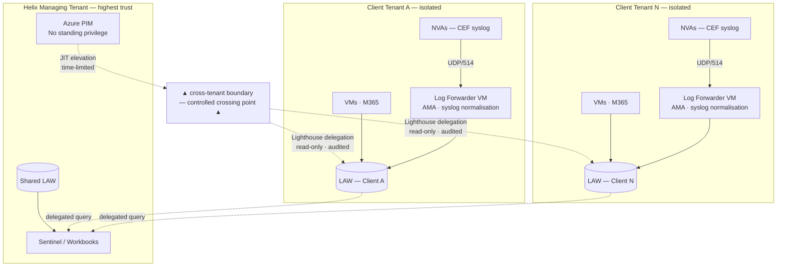
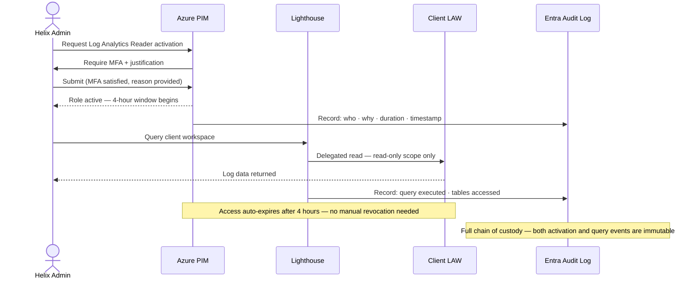

[← Home](../README.md) &nbsp;|&nbsp; [← Architecture](03-architecture.md) &nbsp;|&nbsp; Next: [Team Impact →](05-team-impact.md)

# 4 — Security Controls 🛡️

## 🔑 Identity is the Load-Bearing Wall

Every security property of this architecture depends on the identity model being correct. A misconfigured RBAC assignment or an overly broad Lighthouse delegation scope would silently invalidate the isolation guarantees regardless of how carefully everything else is built. Security design starts here, not at the network layer.

---

## 🚧 Trust Boundaries

Three distinct trust boundaries exist in this architecture. Each requires a different control posture.

**Boundary 1 — Shared platform (Helix tenant):** Standard Azure RBAC within Helix's own tenant. Managed like any production Azure environment — least privilege, no standing admin, Entra PIM for privileged roles.

**Boundary 2 — Cross-tenant (Helix → Client):** This is the high-risk boundary. Crossing it without proper controls is the single most dangerous design failure in this architecture. Managed via Azure Lighthouse + PIM as described below.

**Boundary 3 — Client tenant internal:** Managed by the Pulumi onboarding module. DCRs, AMA, NSG rules, and diagnostic settings are deployed consistently. Clients do not have access to Helix's shared platform.

---

## ⏱️ PIM / JIT Access Flow

---

## 🔦 Azure Lighthouse — What It Does and the Blast Radius

Azure Lighthouse allows Helix to operate on resources in a client's Azure tenant using identities from Helix's own tenant. When a client deploys the Lighthouse registration (an ARM template deployed to their subscription), they grant specific RBAC roles at a specific scope to specific principals in Helix's tenant.

**What this enables:**
- Helix admins query the client's Log Analytics Workspace from the Helix-managed Sentinel and workbooks
- No accounts are created inside the client's Entra directory
- All access is visible in both tenants' Entra audit logs
- Delegations can be revoked by the client at any time

**The blast radius problem:**
If a Helix managing tenant credential with Lighthouse delegation is compromised, the attacker inherits every delegated permission across every client tenant simultaneously. This is the defining risk of the Lighthouse model and must be mitigated at every layer.

---

## 🛡️ Lighthouse Blast Radius Mitigations

### 1. Scope delegation to the workspace, not the subscription

Within each client tenant, the Lighthouse registration delegates `Log Analytics Reader` at the **resource group containing the client's LAW**, not at the subscription level. An attacker who activates the delegation cannot enumerate the client's subscription, modify resources, or pivot to other resource groups — they see only log data in the delegated workspace. Cross-tenant exposure (the same delegation existing in every client) is addressed separately by the PIM/JIT control in §2.

### 2. No standing privilege — PIM-eligible delegation only

The `Log Analytics Reader` role in the Lighthouse delegation is assigned to a **PIM-eligible group** in Helix's Entra tenant, not directly to users or service principals. No Helix user has standing read access to any client workspace. Every access request:
- Requires explicit PIM activation with a stated justification
- Is subject to an approval workflow for sensitive client tiers
- Is valid for a configurable time window (4-hour default; adjustable per Helix policy)
- Generates an audit event in Helix's Entra sign-in and audit logs

### 3. Separate deployment identity from read identity

The service principal used by the Pulumi onboarding pipeline to configure the Lighthouse registration and deploy DCRs in the client tenant has `Contributor` scoped to the client LAW resource group only — it **cannot read log data**. The group that can read log data (PIM-eligible) has no deployment permissions. These are never the same identity.

### 4. Harden the managing tenant

The value of Lighthouse is proportional to the security of the managing tenant. Controls applied to Helix's own Entra tenant:

| Control | Implementation |
|---|---|
| No permanent privileged roles | All `Owner`, `Contributor`, `Security Admin` assignments are PIM-eligible only |
| Conditional Access on admin paths | Require MFA + compliant device + named location for all PIM activations |
| Separate admin identities | Platform operators use a separate cloud-only admin account — not their day-to-day identity |
| Break-glass accounts | Two emergency-access accounts with permanent `Global Admin`, excluded from Conditional Access, MFA hardware-bound, credentials stored in physical safe, alert on any use |
| No client secrets in pipelines | All pipeline authentication uses Workload Identity Federation (OIDC) — no long-lived secrets |

---

## 🤖 Pipeline Identity Model

Pipelines must not hold broad standing privilege. The deployment model uses narrow, purpose-scoped identities per trust boundary — one identity per job, none with more permission than that job requires. No pipeline identity can read log data; no read identity can modify infrastructure. These are never the same credential.

All pipeline authentication uses **Workload Identity Federation (OIDC)** — no long-lived secrets or client credentials stored anywhere. The full identity model with specific role assignments is in the [Implementation Appendix](appendix.md#pipeline-identity-model).

---

## ⚙️ Azure Policy Enforcement

Azure Policy assignments must live **inside the client's subscription** — Policy cannot govern resources cross-tenant. Helix deploys them there during onboarding via the `Resource Policy Contributor` Lighthouse delegation. Once deployed, the policy runs natively inside the client tenant and self-enforces without any ongoing Helix involvement.

Two policy types are applied at the client subscription level:

**`DeployIfNotExists` — Diagnostic Settings:** If any Azure resource — existing or newly created — lacks a diagnostic setting pointing to the client LAW, the policy engine deploys one automatically within minutes. This covers every resource type present at onboarding *and* any resource added to the client subscription afterwards. No Pulumi run required.

**`DeployIfNotExists` — AMA on VMs:** Automatically deploys the Azure Monitor Agent extension to any VM missing it. Covers both VMs present at onboarding and VMs spun up later as the simulation environment grows.

**Effect:** The client subscription is self-healing. A new Windows VM created six months after onboarding will automatically receive diagnostic settings and AMA without any action from Helix or the client. This is the only mechanism that guarantees truly continuous coverage as client environments evolve.

**Effect on Helix operations:** The platform team does not need to track individual resource additions in client tenants. Policy enforces the baseline continuously. Compliance dashboards in Azure Policy show the gap between what should be collected and what is.

---

## 🔒 Log Integrity and Retention Controls

- **Immutable storage:** Client LAWs are configured with a lock that prevents log deletion for the retention period. Clients and Helix operators cannot delete historical entries retroactively.
- **Private Link (high-sensitivity clients):** AMA on client VMs is configured to send data over Private Endpoints rather than public internet, keeping log traffic off the public network entirely. Standard-tier clients use public AMA endpoints; this is acceptable given TLS in transit and the value of the data.
- **Table-level access:** Within the client LAW, `SecurityEvent` and `OfficeActivity` tables are accessible only to the PIM-elevated admin group. Client users see product event tables only. See [Shared LAW Table-Level Access](#shared-law-table-level-access) below for the equivalent boundary on the shared platform.

---

## 📊 Shared LAW — Table-Level Access Boundaries

The Shared LAW contains both developer-accessible telemetry and sensitive platform identity data. Developers holding `Log Analytics Reader` on the Shared LAW can read all tables unless table-level access control is applied.

| Table | Accessible to | Rationale |
|---|---|---|
| `AppTraces`, `ContainerLog`, `ACALogs` | Developers + Security admins | Application debugging — no sensitive identity data |
| `SigninLogs`, `AuditLogs` (Entra) | Security admins only | Identity and authentication events — developer access not required |
| `AzureActivity` | Developers + Security admins | Resource-level activity — useful for deployment debugging |
| `CommonSecurityLog` (Cloudflare WAF) | Security admins only | WAF block events and bot signals — not needed for application debugging |

This is enforced by configuring **workspace-level access mode** as `resource-context` on tables that should be restricted, and assigning `Log Analytics Reader` scoped to individual table resource IDs rather than the workspace root for developer identities.

---

## 🎯 Resource-Context Access Control

Resource-context access control is a Log Analytics feature that restricts a user's query results to resources they have RBAC permissions on, without requiring a separate workspace per persona. It is used in two scenarios in this architecture:

**1. Within client workspaces (client persona):** When a client user is assigned `Log Analytics Reader` scoped to specific resource groups (e.g., only the resource group containing their simulation VMs), they can query the workspace but only see log data produced by those resources. They cannot see security events from other resource groups in the same workspace.

**2. As an alternative tier for cost-sensitive clients:** For clients where contractual data isolation is a preference rather than a hard requirement, a single shared workspace with resource-context access control can replace per-client workspaces. Each client's resources emit to the shared workspace; RBAC scoping ensures each client can only query their own resources' data. This is the "shared workspace tier" referenced in the [Cost Model](06-cost-model.md) and [Options](02-options.md). It is not the default because RBAC misconfiguration silently exposes data across clients — workspace isolation is the safer default.

---

## ⭐ High-Sensitivity Client Tier

Some clients require additional controls beyond the standard baseline. Helix designates a client as **high-sensitivity** when one or more of the following apply:

| Criterion | Examples |
|---|---|
| Industry regulation mandates network-level data segregation | Defence, government, financial services under specific frameworks |
| Client's contractual terms explicitly prohibit public-internet log transport | Data processing agreements with strict network controls |
| Client processes classified or highly sensitive personal data | Healthcare, legal, intelligence-adjacent industries |
| Client explicitly requests elevated isolation as a condition of engagement | Client-driven requirement at contract signing |

High-sensitivity clients receive:
- **Private Link:** AMA sends log data over Private Endpoints — traffic never traverses the public internet
- **Extended Sentinel detection coverage:** Full analytics rule set and automated playbooks, not just the baseline rule set
- **Approval-gated PIM activation:** PIM activation for their workspace requires a second approver, not just MFA
- **Dedicated cost attribution:** Separate budget alert thresholds and billing entity tags

The tier is configured at onboarding time and controls which features are provisioned for that client. See [Automation](07-automation.md) and the [Implementation Appendix](appendix.md) for how this is expressed in the provisioning component.

---

[← Architecture](03-architecture.md) &nbsp;|&nbsp; Next: [Team Impact →](05-team-impact.md)
