[← Home](../README.md) &nbsp;|&nbsp; [← Security Controls](04-security.md) &nbsp;|&nbsp; Next: [Cost Model →](06-cost-model.md)

# 5 — Team Impact 👥

## 📊 Summary Matrix

| Team | What changes | What they gain | What they own |
|---|---|---|---|
| **Infrastructure** | Workspace topology, Lighthouse delegation design, Policy assignments | Reusable onboarding module; consistent baseline across all clients | Workspace architecture, Lighthouse scope definitions, retention config |
| **DevOps** | Pipeline identity model, onboarding automation, OTel integration | No manual steps to add a new client; drift is detected automatically | Pulumi modules, pipeline definitions, Policy remediation workflows |
| **Security — Blue** | Replaces ad-hoc client access with PIM/JIT; gains Sentinel across shared + clients | Full audit trail of every admin access to client data; Sentinel analytics across environments | PIM policies, Sentinel analytics rules, incident response playbooks |
| **Security — Red** | Gains consistent, queryable telemetry from every client environment | Attack path visibility across Windows Event, Sysmon, NVA deny, M365 audit | Red team simulation scenarios, telemetry validation |
| **Business / Finance** | Per-client cost attribution via tagging; predictable scaling model | Can price simulation environments accurately; no surprise log bills | Cost Management tags, budget alerts, client billing reconciliation |
| **Operations** | Centralised dashboard experience; PIM-gated client access replaces manual portal hopping | Single-pane-of-glass across shared + client environments | Workbooks, query packs, alert triage runbooks |
| **Software Development** | OTel SDK integration in simulation engine; ACA diagnostic settings | No security-admin rights needed to debug platform issues; structured traces with consistent schema | OTel instrumentation in Python services, application log schema |

---

## 🏗️ Platform Layers and Ownership

```mermaid
flowchart LR
    subgraph shared_src["Shared Platform Sources\nSoftware Dev owns instrumentation"]
        S1["Django / Python\nOTel SDK"]
        S2["Simulation Engine\nTemporal + OTel"]
    end

    subgraph client_src["Client Tenant Sources\nDevOps provisions via Pulumi — no Dev access"]
        S3["Client VMs\nAMA + DCR"]
        S4["NVAs · M365\nSyslog · Purview"]
    end

    subgraph collection["Collection — DevOps owns this layer"]
        C1["Data Collection Rules\nDCR transformations"]
        C2["Azure Monitor Agent\nAMA on every VM"]
        C3["Azure Policy\nDeployIfNotExists"]
    end

    subgraph storage["Storage — Infrastructure owns this layer"]
        ST1[("Shared LAW\nHelix platform")]
        ST2[("Per-Client LAW\nOne per tenant")]
    end

    subgraph access["Access — Security owns this layer"]
        A1["Microsoft Sentinel\nAnalytics · Playbooks"]
        A2["Azure PIM\nJIT elevation"]
        A3["Lighthouse\nDelegated read"]
    end

    subgraph consume["Consume — Operations serves these personas"]
        P1["Developers\nShared LAW only"]
        P2["IT Admins / Security\nSentinel + PIM"]
        P3["Clients\nOwn workspace only"]
    end

    shared_src --> collection
    client_src --> collection
    collection --> storage
    storage --> access
    access --> consume
```

---

## 📖 Narrative by Team

### 🏗️ Infrastructure

The architecture gives the infrastructure team a **single repeatable pattern** for every client environment. Rather than configuring logging differently per client, onboarding produces the same baseline every time — one workspace, one set of DCRs, one Lighthouse delegation scope. Adding a new client is a Pulumi run, not a project.

The infrastructure team retains ownership of the workspace topology decision (isolated vs shared) and can evolve it per client tier as the business requires. The architecture is designed to support both without rebuilding the collection layer.

### ⚙️ DevOps

The DevOps team benefits most from the **policy-as-code enforcement model**. Once Azure Policy is deployed at the client subscription level, diagnostic settings and AMA are enforced automatically on new resources — the pipeline does not need to track every resource addition manually.

Pipeline identities are scoped narrowly per purpose. There are no broad-privilege deployment credentials. The Pulumi onboarding module is a `ComponentResource` class — adding a new client tenant requires instantiating it with the client's parameters, not copying and modifying a previous deployment.

This setup allows the DevOps team to iterate on simulation environments without touching core client log data, while the Security team retains oversight via Azure Policy and PIM-gated access.

**Initial investment:** The `ClientLoggingBaseline` component, the DCR definitions, the policy assignments, and the Sentinel rule library all need to be built before the first client is onboarded. This is a one-time foundation effort — estimated at several engineering weeks to implement and validate end-to-end — after which each additional client adds only minutes of pipeline runtime. The architecture is designed to reward that upfront investment at scale.

### 🔵 Security — Blue Team

The blue team gains the most operationally. Today, investigating an incident in a client environment likely requires either local credentials in that tenant or a context-switch to a different portal. With this architecture:

1. PIM activation from Helix's managing tenant provides time-limited read access to the client's workspace
2. Cross-workspace queries from Sentinel surface client security events alongside shared platform signals
3. Every PIM activation is recorded in Entra; `LAQueryLogs` on each client LAW captures the queries themselves — chain of custody for forensic investigations is clear

The blue team also gains **Sentinel analytics rules** deployed consistently across all client environments. A detection that catches lateral movement in one client environment is automatically active in all of them.

**Trade-off to be aware of:** PIM activation is not instant. From alert to first query on a client workspace is typically 2–5 minutes — the time to complete a PIM activation request, satisfy MFA, and have the role propagate. This is a deliberate security control, not a bug. For workflows that currently rely on always-on access to client environments, this introduces a short delay worth factoring into incident response planning. The mitigation is pre-activating PIM at the start of a shift when active incidents are expected, rather than activating reactively mid-investigation.

### 🔴 Security — Red Team

Red team operations depend on the fidelity of the simulation environment's telemetry. The architecture ensures:

- Windows Security Events, Sysmon (if deployed), and DNS logs are collected via AMA and visible in the client workspace
- NVA deny logs and IPS alerts are captured in CEF format and queryable
- M365 audit events cover authentication and admin activity in the simulated M365 tenant

Red team exercise outcomes are only meaningful if the telemetry is comprehensive. Gaps in collection are gaps in detection capability — this architecture makes those gaps visible via Azure Policy compliance reporting.

### 💰 Business / Finance

Every client workspace and resource is tagged with `client-id`, `environment`, and `simulation-tier`. Azure Cost Management subscription views slice costs per client automatically.

The tiered log model (Analytics / Basic / Archive) means Helix is not paying Sentinel-tier prices for verbose simulation runtime logs that nobody queries. High-value security and audit events land in Analytics; verbose debug logs land in Basic (80% cost reduction per GB); historical compliance retention lands in Archive. Cost scales proportionally to client count and simulation volume, not faster.

### 📊 Operations

Operations teams access logs through **Workbooks** and **standardised KQL query packs** deployed as code. They do not need to know which workspace a client's data is in — the centralised Workbook queries across delegated workspaces transparently.

For a small team, this removes the burden of maintaining bespoke per-client dashboards. One Workbook template, parameterised by client, serves all of them. Updates to the Workbook are deployed once and apply everywhere.

### 💻 Software Development

Developers access the Shared LAW for shared component debugging (Django, simulation engine, ACA). They have `Log Analytics Reader` on the shared workspace and no access to client workspaces.

OpenTelemetry instrumentation in the Python simulation engine and Django backend provides **structured traces** — developers can correlate a slow simulation run with a specific Temporal workflow execution and the container logs from that ACA revision, without needing a privileged account.

The OTel SDK is vendor-neutral. If Helix ever moves parts of the stack off Azure, the instrumentation layer stays the same and only the exporter endpoint changes.

**What this asks of the software development team:** Integrating the OTel SDK into the Django backend and Temporal workers is a real code change — not a configuration toggle. It requires adding instrumentation at the request handler and workflow activity level, agreeing on a log schema, and exporting to the Azure Monitor Logs Ingestion API endpoint. This is a one-time integration with ongoing maintenance as new services are added. The benefit is that developers gain structured, queryable traces without needing elevated cloud permissions — a net productivity gain once the instrumentation is in place, but an upfront engineering commitment to get there.

---

## 🗳️ Decisions Required From the Team

This architecture makes a recommendation, but several decisions belong to the team rather than to the proposal. These should be resolved before or during implementation.

| Team | Decision needed |
|---|---|
| **Infrastructure** | Standard workspace layout, naming conventions, regions, retention defaults, and tenant onboarding pattern |
| **DevOps** | Whether Pulumi owns the full observability baseline or only deploys shared modules consumed by tenant stacks |
| **Security** | Required logs for detection vs troubleshooting, PIM activation duration, approval flow design, break-glass model, and Sentinel analytics rule coverage per client tier |
| **Business** | Client-facing log visibility expectations and contractual commitments around data access, retention, and residency |
| **Operations / Finance** | Monthly cost guardrails, ingestion budgets per client, archive policy, and alerting thresholds for abnormal log volume |
| **Software Development** | Required structured logging fields, correlation ID conventions, severity standards, and application telemetry schema |

---

## 💬 Discussion Points

Questions worth raising with the full team before committing to implementation:

1. **Should client-facing event data live in Azure Monitor only, or also flow to a product analytics or event store?** Log Analytics is optimised for operational observability — not product reporting. If clients need rich query, export, or long-term analytics over their simulation event data, a separate product event pipeline may be warranted alongside the logging platform.
2. **Which logs are mandatory for Sentinel detection versus troubleshooting only?** This determines Analytics vs Basic tier routing — and matters because Basic logs cannot be used for Sentinel analytics rules or automated detections.
3. **What is the maximum acceptable PIM activation window for cross-tenant access?** The proposal uses a 4-hour default. Security posture may prefer shorter; operational convenience may prefer longer. The team should set this deliberately.
4. **Should clients access their event data through Azure-native Workbooks, or through a product-embedded UI?** The proposal assumes Azure portal Workbooks deployed into the client tenant. A product-embedded experience is a different access and authentication model and should be decided early.
5. **What retention periods are commercial commitments versus engineering convenience?** Some clients may have contractual minimums; others may not care. Per-client retention policy is a parameter, but the defaults need a business decision behind them.
6. **Should onboarding be Temporal-orchestrated from day one, or start with Pulumi modules and add orchestration once client volume grows?** Temporal adds durability and external-signal handling; it also adds operational complexity. The team should decide at what scale that investment is justified.

---

[← Security Controls](04-security.md) &nbsp;|&nbsp; Next: [Cost Model →](06-cost-model.md)
