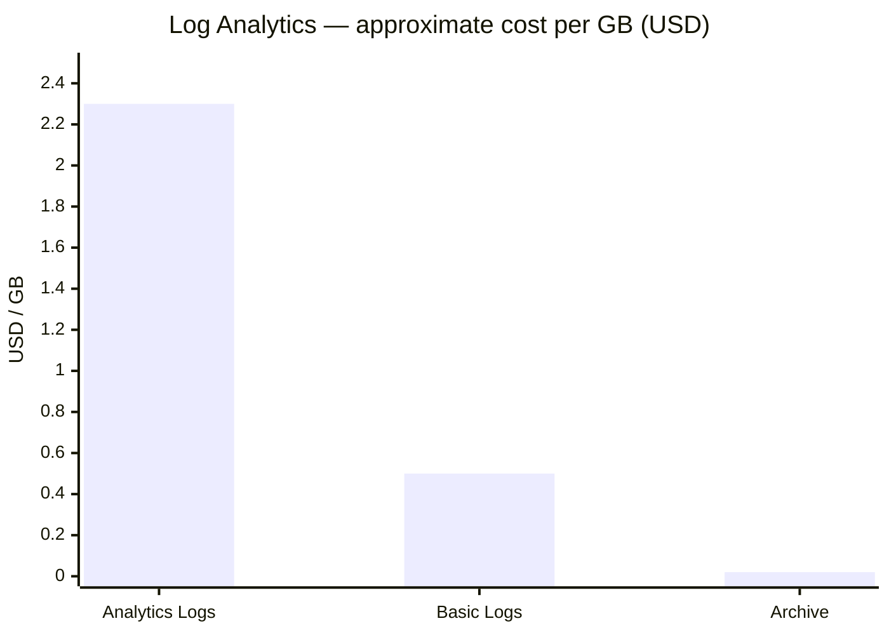
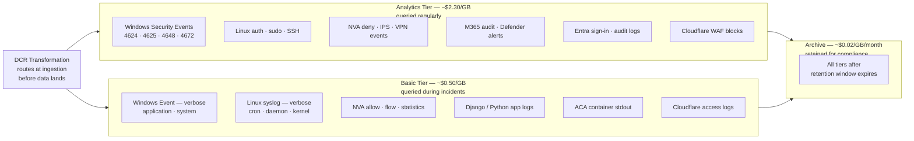

[← Home](../README.md) &nbsp;|&nbsp; [← Team Impact](05-team-impact.md) &nbsp;|&nbsp; Next: [Automation →](07-automation.md)

# 6 — Cost Model

## Design Principle

Not all logs have equal value. Charging Sentinel-tier prices for verbose container debug output is an avoidable tax on the platform. The cost model separates logs into three tiers based on access frequency and operational importance, then routes each category to the appropriate tier automatically at ingestion time via DCR transformations.

---

## Log Tiers

| Tier | Azure product | Retention default | Per GB cost (approx.) | Use case |
|---|---|---|---|---|
| **Analytics** | Log Analytics — Analytics Logs | 90 days hot | ~$2.30/GB ingested | Security events, audit logs, product events — queried regularly, often within hours of ingestion |
| **Basic** | Log Analytics — Basic Logs | 8 days hot | ~$0.50/GB ingested | Verbose app logs, container stdout, debug traces — queried occasionally, usually only during incidents |
| **Archive** | Log Analytics — Archive | Up to 12 years from ingestion | ~$0.02/GB/month | Compliance retention, historical forensics — rarely queried; restored on-demand for specific investigations |



> **DCR transformations** filter and route at ingestion time. A DCR for Windows Event logs can route Security Event ID 4624 (logon) to Analytics while routing noisy Event ID 5145 (file share access) to Basic — before the data ever lands in a table. This is the most cost-effective control available because filtered data is never stored.

---

## Per-Source Tier Assignment

| Log category | Tier | Rationale |
|---|---|---|
| Windows / Linux authentication and privilege events | Analytics | Core security signals — queried frequently during incidents and investigations |
| Windows / Linux verbose system and application events | Basic | High volume, low routine value — queried only during active investigations |
| NVA deny, IPS, and VPN events | Analytics | Network security decisions — queried in blue team exercises and incident triage |
| NVA allow, statistics, and flow logs | Basic | High volume; low value unless tracing a specific lateral movement path |
| M365 audit, admin activity, Defender alerts | Analytics | Compliance and security — primary audit trail for M365 environments |
| Django / Python application and container logs | Basic | Platform debugging — high volume, incident-driven queries only |
| Cloudflare WAF blocks and bot events | Analytics | Actionable security signals — small volume, high value |
| Cloudflare access logs (non-WAF) | Basic | High volume; not routinely queried |
| Entra sign-in and audit logs | Analytics | Identity events — always relevant for security posture |
| GitHub Actions / Pulumi Cloud audit | Basic | Deployment audit trail — queried during security investigations |

The full per-event-ID routing table is in the [Implementation Appendix](appendix.md#per-source-log-tier-assignment).

---

## Where Each Log Category Lands



## Billing Ownership

The Log Analytics Workspace and Sentinel instance for each client are deployed **inside the client's Azure subscription**. This means the Azure invoice for that storage and compute lands on whichever billing account owns the subscription.

Two operating models are possible:

| Model | Who receives the Azure bill | Implication |
|---|---|---|
| **Helix-managed subscriptions** (recommended) | Helix | Azure costs are Helix's operational cost, recovered through service pricing. The `billing-entity: client` tag enables Helix to attribute and report costs per client internally — not to split the Azure bill, but to price each simulation environment accurately. |
| **Client-owned subscriptions** | The client | LAW + Sentinel costs land on the client's own Azure bill. This must be agreed contractually at onboarding — the client is accepting Azure charges as a condition of the platform. |

For a cybersecurity simulation platform, **Helix-managed subscriptions** is the expected model: Helix provisions the full environment, owns the Azure resources, and bundles infrastructure cost into the service price. The per-client cost attribution tags exist so that Helix knows exactly what each client environment costs — and can price it accurately.

If a client brings their own Azure subscription, the onboarding contract must explicitly state that deploying the logging baseline will incur Azure charges (estimated at the amounts in this document) on their bill.

---

## Cost Comparison: Isolated vs Shared Workspaces (Option A vs Option B)

The architecture recommends one workspace per client (Option A). The following illustrates the cost difference against a shared workspace model (Option B) to show the trade-off explicitly. See [Options](02-options.md) for the full architectural comparison.

**Assumptions:** 10 clients, each generating 10 GB/day of analytics-tier logs. USD approximate prices.

| Model | Daily volume | Rate | Monthly cost (Log Analytics) | Monthly cost (Sentinel) | **Total** |
|---|---|---|---|---|---|
| 10 isolated workspaces | 10 GB/day each | PAYG ~$2.30/GB | ~$6,900 | ~$7,380 | **~$14,280** |
| 1 shared workspace | 100 GB/day total | 100 GB/day commitment ~$1.96/GB | ~$5,880 | ~$6,300 | **~$12,180** |
| **Difference** | | | | | **~$2,100/month (~15%)** |

The saving grows at scale. At 30 clients (300 GB/day) the commitment tier discount reaches 20–25% and the shared workspace qualifies for an **Azure Monitor Dedicated Cluster** (approx. $0.16/GB at 100+ GB/day), widening the gap further.

### Why the isolated model is the right choice despite the cost premium

The ~15% cost difference is real. The table below lays out what that premium buys:

| Reason | Isolated (Option A) | Shared (Option B) |
|---|---|---|
| **Data residency** | Each client's raw data stays inside their own Entra boundary — never co-located with another client's data | All clients' raw security events land in one workspace — contractually untenable for defence, government, or any regulated client |
| **Blast radius** | A compromised Helix credential exposes one client's data for the PIM window duration | A compromised workspace admin exposes all clients' data simultaneously, with no time limit |
| **Audit trail** | Each client's workspace has its own query audit log — forensic investigations are clean and unambiguous | All clients share one audit log — impossible to prove a Helix admin only accessed Client A's data, not Client B's |
| **RBAC and access control** | Clean boundary — RBAC is a resource scope on a single LAW | Shared workspace requires resource-context access control, which has known limitations and adds operational complexity |
| **Retention policy** | Per-client retention set at onboarding — different clients can have different policies without affecting each other | One retention setting for all — a client requiring 2-year compliance retention forces that cost on every client |
| **Client trust and auditability** | Clients can verify that their data is in their own tenant under their own Azure controls | Clients must trust Helix's access controls — difficult to evidence in a due diligence review |
| **Incident isolation** | A workspace misconfiguration or policy failure in one client does not affect others | One configuration error can affect all clients |
| **Regulatory** | GDPR, HIPAA, and defence frameworks typically prohibit co-location of data across legal entities | Co-location would disqualify Helix from serving regulated clients entirely |

**The trade-off is explicit:** isolated workspaces cost approximately 15% more at 10 clients — around $2,100/month in this model. That premium buys clean data residency guarantees, a bounded blast radius, and per-client audit trails that are difficult to replicate in a shared model. For clients in regulated industries or with contractual data isolation requirements, those guarantees are likely non-negotiable. For others, the shared model remains a viable lower-cost option that Helix could offer as a distinct service tier if the business case supports it.

---

## Per-Client Cost Attribution

Every resource deployed by the Pulumi onboarding module is tagged:

```
client-id: acme-corp
environment: simulation
log-tier: standard
billing-entity: client
```

Azure Cost Management filters by these tags to generate per-client cost reports. The finance team can see exactly what each simulation environment costs in log ingestion, storage, and compute — enabling accurate client billing and margin tracking.

---

## Scale-to-Zero Properties

A key brief requirement is that the solution scales to zero where possible. The architecture supports this at every layer:

| Component | Scale-to-zero behaviour |
|---|---|
| ACA (Simulation Engine) | Native — ACA scales containers to zero when idle; log streams stop, no ingestion cost |
| DCRs on client VMs | No ingestion when VMs are deallocated — cost automatically zero |
| Kinesis Firehose (AWS) | Pay per GB — zero cost when no data flows |
| OTel Collector | Deployed as ACA sidecar — scales with the application it instruments |
| Lighthouse delegation | No cost — only metered when logs are actually queried |
| Basic Logs tier | 8-day retention window self-clears; minimal storage cost for idle environments |

When a client simulation environment is not running, its logging cost is effectively zero. The per-client LAW retains historical data in Archive tier at ~$0.02/GB/month, but active ingestion costs drop to zero automatically.

---

## Cost Controls

- **DCR transformation rules** filter noise before it lands in any table — the most effective cost lever available
- **Table-level Basic Logs** designation applied to verbose tables on workspace creation
- **Commitment tier review** monthly — move to a higher commitment tier when volume stabilises above a threshold
- **Budget alerts** per workspace tagged `billing-entity: client` — alert at 80% of expected monthly spend
- **Archive policy** — after 90 days (Analytics) or 8 days (Basic), data moves to Archive automatically without manual intervention. Data is retained in Archive for up to 12 years from the original ingestion date, or until explicitly deleted — whichever comes first. The retention period is set per workspace at onboarding via the Pulumi module.

---

[← Team Impact](05-team-impact.md) &nbsp;|&nbsp; Next: [Automation →](07-automation.md)
