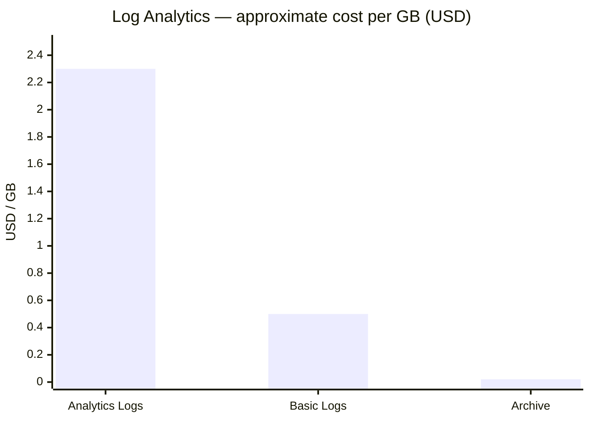
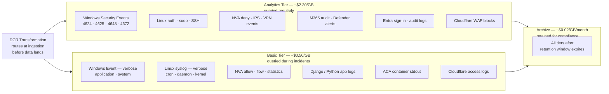

[← Home](../README.md) &nbsp;|&nbsp; [← Team Impact](05-team-impact.md) &nbsp;|&nbsp; Next: [Automation →](07-automation.md)

# 6 — Cost Model

## Design Principle

Not all logs have equal value. Charging Sentinel-tier prices for verbose container debug output is an avoidable tax on the platform. The cost model separates logs into three tiers based on access frequency and operational importance, then routes each category to the appropriate tier automatically at ingestion time via DCR transformations.

---

## Log Tiers

| Tier | Azure product | Retention default | Per GB cost (approx.) | Use case |
|---|---|---|---|---|
| **Analytics** | Log Analytics — Analytics Logs | 90 days hot | ~$2.30/GB ingested | Security events, audit logs, product events — queried regularly, often within hours of ingestion |
| **Basic** | Log Analytics — Basic Logs | 8 days hot | ~$0.50/GB ingested | Verbose app logs, container stdout, debug traces — queried occasionally, usually only during incidents |
| **Archive** | Log Analytics — Archive | Up to 12 years from ingestion | ~$0.02/GB/month | Compliance retention, historical forensics — rarely queried; restored on-demand for specific investigations |



> **DCR transformations** filter and route at ingestion time. A DCR for Windows Event logs can route Security Event ID 4624 (logon) to Analytics while routing noisy Event ID 5145 (file share access) to Basic — before the data ever lands in a table. This is the most cost-effective control available because filtered data is never stored.

---

## Per-Source Tier Assignment

| Log source | Recommended tier | Rationale |
|---|---|---|
| Windows Security Events (4624, 4625, 4648, 4672, 4720...) | Analytics | Core authentication and privilege events — high query frequency in security operations |
| Windows Event — verbose (application, system, verbose audit) | Basic | Useful during incident investigation; not routinely queried |
| Linux auth / syslog (auth, sudo, SSH) | Analytics | Authentication and privilege escalation signals |
| Linux syslog — verbose (cron, daemon, kernel) | Basic | Low operational value outside active investigation |
| NVA — deny / IPS / VPN events | Analytics | Network security decisions — queried in blue team exercises and incident triage |
| NVA — allow / statistics / flow | Basic | High volume, low value unless actively investigating a lateral movement path |
| M365 audit (admin activity, Purview, Defender) | Analytics | Compliance and security — queried for audit and investigation |
| Django / Python application logs | Basic | Platform debugging — high volume, queried only during incidents |
| ACA container logs | Basic | High volume simulation output — useful during dev/debug, not in steady state |
| Cloudflare access logs | Basic | High volume; Analytics only for WAF block/challenge events via DCR filter |
| Cloudflare WAF blocks and bot events | Analytics | Actionable security signals — small volume, high value |
| Entra sign-in and audit logs | Analytics | Identity events — always relevant for security posture |

---

## Where Each Log Category Lands



## Cost Comparison: Isolated vs Shared Workspaces (Option A vs Option B)

The architecture recommends one workspace per client (Option A). The following illustrates the cost difference against a shared workspace model (Option B) to show the trade-off explicitly. See [Options](02-options.md) for the full architectural comparison.

**Assumptions:** 10 clients, each generating 10 GB/day of analytics-tier logs. USD approximate prices.

| Model | Daily volume | Rate | Monthly cost (Log Analytics) | Monthly cost (Sentinel) | **Total** |
|---|---|---|---|---|---|
| 10 isolated workspaces | 10 GB/day each | PAYG ~$2.30/GB | ~$6,900 | ~$7,380 | **~$14,280** |
| 1 shared workspace | 100 GB/day total | 100 GB/day commitment ~$1.96/GB | ~$5,880 | ~$6,300 | **~$12,180** |
| **Difference** | | | | | **~$2,100/month (~15%)** |

The saving grows at scale. At 30 clients (300 GB/day) the commitment tier discount reaches ~20–25% and the shared workspace qualifies for an **Azure Monitor Dedicated Cluster** (~$0.16/GB at 100+ GB/day), widening the gap further.

**The trade-off is explicit:** isolated workspaces cost ~15% more at 10 clients. For clients where data isolation is contractually required (defence, government, regulated industries), that premium is non-negotiable. For clients where isolation is a preference rather than a requirement, a shared workspace with resource-context access control is a viable option that Helix can offer as a lower-cost tier.

---

## Per-Client Cost Attribution

Every resource deployed by the Pulumi onboarding module is tagged:

```
client-id: acme-corp
environment: simulation
log-tier: standard
billing-entity: client
```

Azure Cost Management filters by these tags to generate per-client cost reports. The finance team can see exactly what each simulation environment costs in log ingestion, storage, and compute — enabling accurate client billing and margin tracking.

---

## Scale-to-Zero Properties

A key brief requirement is that the solution scales to zero where possible. The architecture supports this at every layer:

| Component | Scale-to-zero behaviour |
|---|---|
| ACA (Simulation Engine) | Native — ACA scales containers to zero when idle; log streams stop, no ingestion cost |
| DCRs on client VMs | No ingestion when VMs are deallocated — cost automatically zero |
| Kinesis Firehose (AWS) | Pay per GB — zero cost when no data flows |
| OTel Collector | Deployed as ACA sidecar — scales with the application it instruments |
| Lighthouse delegation | No cost — only metered when logs are actually queried |
| Basic Logs tier | 8-day retention window self-clears; minimal storage cost for idle environments |

When a client simulation environment is not running, its logging cost is effectively zero. The per-client LAW retains historical data in Archive tier at ~$0.02/GB/month, but active ingestion costs drop to zero automatically.

---

## Cost Controls

- **DCR transformation rules** filter noise before it lands in any table — the most effective cost lever available
- **Table-level Basic Logs** designation applied to verbose tables on workspace creation
- **Commitment tier review** monthly — move to a higher commitment tier when volume stabilises above a threshold
- **Budget alerts** per workspace tagged `billing-entity: client` — alert at 80% of expected monthly spend
- **Archive policy** — after 90 days (Analytics) or 8 days (Basic), data moves to Archive automatically without manual intervention. Data is retained in Archive for up to 12 years from the original ingestion date, or until explicitly deleted — whichever comes first. The retention period is set per workspace at onboarding via the Pulumi module.
