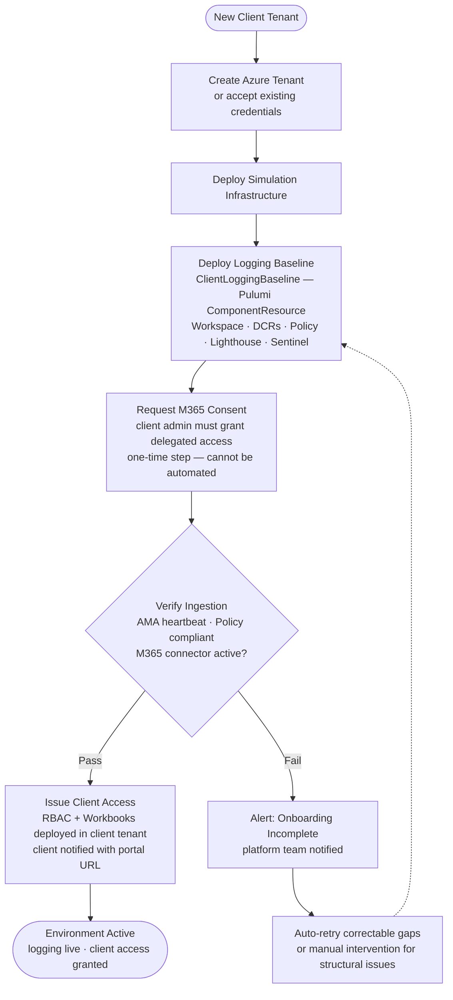

[← Home](../README.md) &nbsp;|&nbsp; [← Cost Model](06-cost-model.md) &nbsp;|&nbsp; Next: [Risks →](08-risks.md)

# 7 — Automation 🤖

## 🎯 Design Principle

A logging platform that requires manual steps to onboard each client tenant will not scale. The onboarding of a new client's logging baseline must be a **code execution**, not a project. Every configuration decision made once must apply everywhere, consistently, without drift.

---

## 🐍 Why Pulumi in Python

Pulumi is already used across the platform for infrastructure provisioning. Python enables the client logging baseline to be expressed as a **reusable component class** — instantiated with client-specific parameters rather than copied and modified per deployment. This is the difference between a platform and a collection of scripts.

Compared to DSL-based tools (Terraform HCL, Bicep), Python supports the conditional logic this architecture requires: branching on client tier, iterating over VM resource IDs, conditionally enabling Private Link, and returning typed outputs for downstream orchestration — all without workarounds.

The full component code is in the [Implementation Appendix](appendix.md#pulumi-component-architecture).

---

## 📦 What the Automation Provisions

A single component instantiation for a new client deploys the complete logging baseline:

- **Log Analytics Workspace** — isolated, per-client, in the client's own tenant; `LAQueryLogs` diagnostic setting enabled so every KQL query against the workspace is recorded for audit
- **Data Collection Rules** — configured for Windows, Linux, and CEF/syslog sources
- **Azure Policy assignments** — diagnostic settings and AMA enforcement, self-healing
- **Lighthouse registration** — read delegation to the Helix PIM group, scoped to the LAW resource group
- **Microsoft Sentinel** — enabled on the workspace; M365 connector configured
- **Client RBAC** — `Log Analytics Reader` and Workbooks deployed in the client's tenant

One command. One consistent baseline. No portal clicks. No drift.

---

## 🚀 Onboarding Pipeline

Every client environment is provisioned through a Temporal workflow — the same orchestration engine already used by the simulation engine. Logging is a mandatory step in that workflow, not an optional add-on. A client environment cannot be marked ready without a verified logging baseline.

**Why Temporal and not a GitHub Actions pipeline:** Several onboarding steps are incompatible with a CI/CD pipeline model. The M365 consent request may wait up to 48 hours for a client admin response. Infrastructure retries may span minutes to hours. If a worker restarts mid-provisioning, the process must resume from where it stopped — not restart from scratch. GitHub Actions is the right tool for delivery pipelines triggered by repository events; Temporal is the right tool for durable, stateful processes that need to wait on external signals, recover from partial failures, and maintain execution state across restarts. The onboarding workflow is firmly in the second category.

**M365 consent:** The M365 Defender/Purview connector requires the client's M365 Global Administrator to grant delegated consent to the platform's Sentinel managed application. This is a one-time, human action in the client's tenant. The workflow dispatches a consent URL to the client contact and waits for confirmation before proceeding. If consent is not granted within 48 hours, the platform team is alerted and the client environment is marked ready without M365 ingestion — Azure log collection is fully operational, and M365 can be enabled later when consent is obtained.

**Onboarding failure handling:** If ingestion verification fails, the pipeline retries the logging baseline deployment with backoff (up to three attempts). Correctable failures — such as a policy compliance lag or a DCR propagation delay — typically resolve within minutes. If retries are exhausted, the platform team is paged and the client environment is held in a non-ready state. A client environment is not marked ready until the logging baseline has been verified — this is the proposed gate, and the team should validate whether it fits the existing operational model.

---

## ⚙️ Policy as Code

Azure Policy assignments are deployed by the Pulumi component, not applied manually. Two effects enforce the baseline automatically:

**`DeployIfNotExists` — Diagnostic Settings:** Any Azure resource in the client subscription that lacks a diagnostic setting pointing to the client LAW receives one automatically, within minutes. This covers resources present at onboarding and resources added months later — the platform team does not need to track individual additions.

**`DeployIfNotExists` — AMA on VMs:** Any VM in the client subscription without the Azure Monitor Agent extension receives it automatically. The onboarding workflow validates compliance before marking the environment ready.

Once deployed, policy runs natively inside the client tenant and self-enforces without any ongoing involvement from Helix.

---

## 📊 Dashboards and Query Packs as Code

Workbooks and saved KQL queries are deployed as Pulumi-managed resources. This means:

- A new detection query is deployed to all client workspaces on the next pipeline run — no manual export/import
- Workbook changes are reviewed via pull request before deployment
- Rollback is a pipeline revert, not a manual portal operation

Three query packs cover the three personas: **client** (simulation events), **developer** (traces, error rates, ACA scaling), **security** (authentication, privilege escalation, NVA deny trends, M365 anomalies).

---

## 🔍 Detection Rule Lifecycle

Sentinel analytics rules are deployed as code to all client workspaces. Coverage is tiered:

| Detection category | Standard tier | High-sensitivity tier |
|---|---|---|
| Authentication anomalies, brute force, impossible travel | Included | Included |
| Privilege escalation and lateral movement | Included | Included |
| NVA deny trend analysis, M365 admin anomalies | Included | Included |
| SOAR playbooks (auto-contain, automated response) | Not included | Included |
| Extended threat hunting rules | Not included | Included |

Rule changes go through a pull request review and are promoted to a test workspace before deployment to all clients. Per-client suppression (false-positive exclusions) is isolated — a suppression for one client does not affect others.

---

## 📡 Platform Self-Monitoring

The logging platform must monitor itself. A silent failure in the collection pipeline — a broken DCR, a stopped AMA agent, a lapsed Lighthouse delegation — leaves gaps that only become visible during an incident when the logs are needed most.

**Ingestion health:** Azure Monitor provides built-in workspace ingestion metrics (bytes ingested, ingestion latency, data gaps per table). Alerts are configured on the Shared LAW and on each client LAW to fire when ingestion volume drops below expected thresholds for more than 30 minutes. A client environment with no ingestion activity during a live simulation is an anomaly that warrants investigation.

**AMA and DCR compliance:** Azure Policy compliance dashboards show, in real time, how many VMs in each client subscription are compliant with AMA presence and DCR attachment. Non-compliant resources trigger both an automated remediation task and a notification to the platform team.

**Lighthouse delegation health:** Delegation registrations can expire or be revoked by the client. A scheduled weekly check validates that all expected Lighthouse delegations are still active and surfaces any that have lapsed or been removed.

**Pipeline health:** GitHub Actions and Pulumi Cloud send workflow status to the Shared LAW. Failed onboarding or drift-correction pipeline runs generate alerts to the platform team before they become client-impacting issues.

---

## 🔄 Drift Detection

After onboarding, two mechanisms keep environments at baseline:

1. **Azure Policy continuous compliance** — evaluated every 24 hours. Non-compliant resources trigger automated remediation tasks without manual intervention.

2. **Pulumi refresh in CI** — a scheduled weekly run compares Pulumi state against actual Azure state. Correctable gaps (e.g. a DCR association missing from a new VM) are auto-applied. Structural drift (e.g. a retention setting changed) is raised as a pull request for platform team review.

Azure Policy handles resource-level gaps continuously. Pulumi handles workspace-level configuration drift weekly. Neither requires manual per-tenant audit.

---

[← Cost Model](06-cost-model.md) &nbsp;|&nbsp; Next: [Risks →](08-risks.md)
