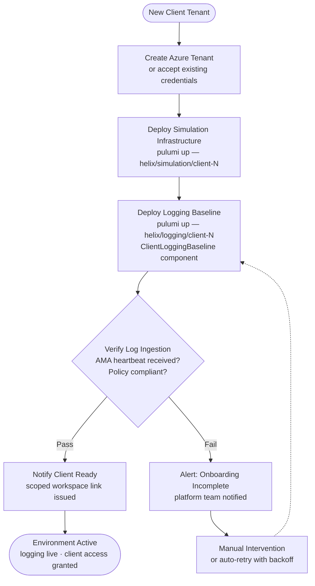

[← Home](../README.md)

# 7 — Automation

## Design Principle

A logging platform that requires manual steps to onboard each client tenant will not scale. The onboarding of a new client's logging baseline must be a **code execution**, not a project. Every configuration decision made once must apply everywhere, consistently, without drift.

---

## Why Pulumi in Python

Helix already uses Pulumi as its IaC platform of choice. Python enables the client logging baseline to be expressed as a reusable class — instantiated with client-specific parameters, not copied and modified per deployment. This is the difference between a **platform** and a collection of scripts.

DSL-based tools (Terraform HCL, Bicep) require workarounds like `for_each` with complex dynamic blocks to express conditional logic. In Python, the client baseline class can:
- Branch on client tier (standard vs high-sensitivity)
- Iterate over a list of VM resource IDs to attach DCRs
- Conditionally enable Private Link based on client configuration
- Register the Lighthouse delegation only after confirming the client has deployed the ARM template
- Return typed outputs that downstream Temporal workflows can consume

---

## Pulumi Component Architecture

```python
# Client logging baseline — one instantiation per client tenant
class ClientLoggingBaseline(pulumi.ComponentResource):
    """
    Provisions the complete logging baseline for one client tenant:
      - Log Analytics Workspace (isolated, per-client)
      - Data Collection Rules for Windows, Linux, and CEF sources
      - Azure Policy assignments (diagnostic settings, AMA enforcement)
      - Lighthouse registration (read delegation to Helix PIM group)
      - Sentinel enablement and M365 connector configuration
      - RBAC: client reader group scoped to this workspace
    """
    def __init__(self, client_id: str, config: ClientConfig, opts=None):
        super().__init__("helix:logging:ClientLoggingBaseline", client_id, {}, opts)
        # workspace, dcrs, policy, lighthouse, sentinel...


class SharedPlatformLogging(pulumi.ComponentResource):
    """
    Provisions Helix's shared observability layer:
      - Shared Log Analytics Workspace
      - Microsoft Sentinel
      - Cloudflare Logpush DCR
      - OTel ingestion endpoint
      - Entra diagnostic settings
      - Standard workbooks and query packs
    """


class AwsLogForwarder(pulumi.ComponentResource):
    """
    Configures the AWS → Azure log forwarding path:
      - Kinesis Firehose delivery stream → Azure Blob Storage
      - DCR to process Firehose output on ingestion
      - OTel Collector configuration for Django/Python services
    """
```

Each class encodes the full set of decisions for its domain. A new engineer onboarding a client runs one command:

```python
# main.py — client onboarding stack
baseline = ClientLoggingBaseline(
    client_id="acme-corp",
    config=ClientConfig(
        subscription_id="...",
        location="australiaeast",
        tier="standard",          # or "high-sensitivity" for isolated Private Link
        vm_resource_ids=[...],
        m365_tenant_id="...",
    )
)
```

`pulumi up` provisions the workspace, DCRs, policy assignments, and Lighthouse delegation. No manual steps. No portal clicks.

---

## Onboarding Pipeline



New client environments at Helix are provisioned through a Temporal workflow (the simulation engine already uses Temporal for orchestration). The logging baseline is a step in that workflow — not a separate manual process.

```
Temporal Workflow: provision-client-environment
  ├── Activity: create_azure_tenant (or accept existing)
  ├── Activity: deploy_simulation_infrastructure (existing Pulumi stack)
  ├── Activity: deploy_logging_baseline          ← ClientLoggingBaseline
  │   └── pulumi up helix/logging/client-{id}
  ├── Activity: verify_log_ingestion             ← smoke test: confirm AMA heartbeat
  └── Activity: notify_client_ready
```

This integration means logging is never an afterthought. Every client environment that exists has a logging baseline. There is no configuration drift between environments because the same code path runs for every client.

---

## Policy as Code

Azure Policy assignments are deployed by the Pulumi onboarding module, not applied manually in the portal. Two policy effects are used:

**`DeployIfNotExists`** — used for diagnostic settings on Azure resources. If a new Azure resource (VM, storage account, key vault) appears in the client subscription without a diagnostic setting pointing to the client LAW, Azure Policy deploys one automatically within minutes. The Pulumi pipeline does not need to track individual resource additions.

**`AuditIfNotExists`** — used as a compliance gate for AMA presence on VMs. The compliance API is polled by the Temporal workflow's `verify_log_ingestion` activity. A non-compliant VM blocks the workflow from marking the environment as ready.

Policy definitions are stored in the Pulumi repository as JSON/Python objects — version-controlled, reviewable, and deployed consistently across all client subscriptions.

---

## Dashboard and Query Packs as Code

Workbooks and saved KQL queries are deployed as Pulumi resources (ARM template outputs or `azure-native.operationalinsights.SavedSearch`). This means:

- A new detection query written by the security team is deployed to all client workspaces on the next pipeline run
- Workbook changes are reviewed via pull request before deployment
- There is no manual "export from portal, import elsewhere" workflow
- Rollback is `pulumi destroy` on the affected resource

Standard query packs cover the three personas:
- **Client pack:** product event tables, simulation lifecycle events
- **Developer pack:** request traces, error rates, latency percentiles, ACA scaling events
- **Security pack:** authentication events, privilege escalation patterns, NVA deny trends, M365 anomalies

---

## Drift Detection

After initial onboarding, the logging baseline can drift if resources are added or configurations changed manually. Two mechanisms detect and correct drift:

1. **Azure Policy continuous compliance:** Evaluated every 24 hours. Non-compliant resources are reported in the Azure Policy compliance dashboard and can trigger automated remediation tasks.

2. **Pulumi refresh in CI:** A scheduled pipeline run executes `pulumi refresh` weekly against each client stack. Drift between Pulumi state and actual Azure state is surfaced as a diff — reviewed by the platform team and either accepted or corrected.

These two mechanisms together mean that a client environment that has been modified post-onboarding is detected and brought back to baseline, without requiring manual audit of each tenant.
