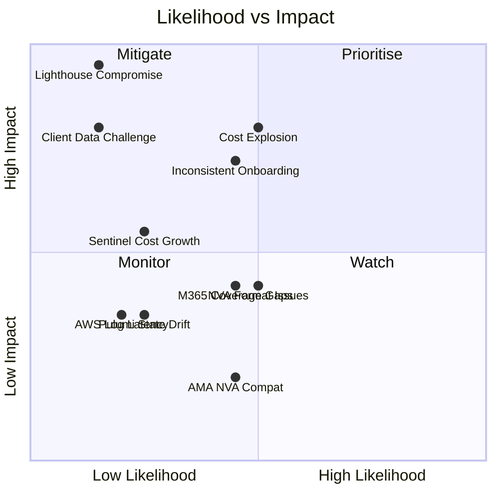

[← Home](../README.md) &nbsp;|&nbsp; [← Automation](07-automation.md)

# 8 — Risks and Mitigations

## Risk Matrix

> Lighthouse Compromise sits in the top-left — low probability, critical impact. The mitigations (PIM/JIT, scoped delegation, hardened managing tenant) are specifically designed to keep it there.

---

## Risk Register

| # | Risk | Likelihood | Impact | Mitigation |
|---|---|---|---|---|
| 1 | Lighthouse / managing tenant credential compromise | Low | Critical | PIM/JIT — no standing access; narrow delegation scope (LAW read only); hardened managing tenant; break-glass separation |
| 2 | Cost explosion from verbose simulation log ingestion | Medium | High | DCR filtering before ingestion; Basic Logs tier for verbose tables; budget alerts per client; archive after retention window |
| 3 | Inconsistent client onboarding creates logging gaps | Medium | High | Pulumi `ComponentResource` — all clients get same baseline; Policy `DeployIfNotExists` fills gaps for new resources; Temporal workflow enforces logging as a gate |
| 4 | NVA log format inconsistency across Fortinet/pfSense versions | Medium | Medium | Standardise on CEF output format; log forwarder VM normalises before AMA; test per NVA model during client onboarding validation |
| 5 | M365 Purview connector coverage gaps | Medium | Medium | Document which M365 audit tables are available per licence tier; set client expectations at onboarding; supplement with Entra sign-in logs where M365 audit is incomplete |
| 6 | AWS → Azure log latency unacceptable for real-time use | Low | Medium | OTel path (near-real-time) for application logs; Kinesis Firehose path (minutes latency) is infrastructure-only — document the SLO boundary; no use case in the brief requires sub-minute AWS log delivery |
| 7 | Client challenges Helix's access to their log data | Low | High | Lighthouse audit log provides complete chain of custody; PIM activation record shows who accessed what and why; access is time-limited and revocable by the client; contractual access terms defined at onboarding |
| 8 | Pulumi state drift in long-lived client environments | Low | Medium | Weekly `pulumi refresh` in CI; Azure Policy continuous compliance evaluation; drift surfaced as PR diff for review |
| 9 | AMA not supported on some NVA operating systems | Medium | Low | NVAs use syslog forwarding to a dedicated Linux log forwarder VM — AMA is only required on the forwarder, not the NVA itself |
| 10 | Sentinel cost grows faster than expected at scale | Low | Medium | Sentinel is enabled on all client workspaces (required for M365 connector and cross-workspace analytics). Cost is controlled by tiering analytics rule coverage — standard clients get a baseline rule set only; high-sensitivity clients get full detection. Verbose tables (Basic Logs tier) do not incur Sentinel per-GB charges. |

---

## Deep Dive: Risk 1 — Lighthouse Blast Radius

This is the only risk in the register that is both low probability and catastrophic in its potential impact. It deserves more than a table entry.

**Scenario:** A Helix platform engineer's account is compromised. The attacker activates the PIM-eligible Lighthouse delegation role and gains read access to a client's Log Analytics Workspace.

**What they can see:** All clients' security events, authentication logs, M365 audit trails, and NVA logs for the duration of the PIM window (4-hour default). This is the real blast radius — all clients, simultaneously, for the window duration.

**What they cannot do:**
- Modify or delete log data in any client workspace (all Lighthouse delegations are read-only)
- Access any client tenant's compute, network, or identity resources (delegation is scoped to Log Analytics only)
- Extend their access beyond the PIM window without a new activation (which generates another audit event and requires a fresh MFA challenge)

**Why this is an acceptable residual risk:** The blast radius is bounded by design. A credential compromise that also bypasses MFA results in read-only access to all clients' log data for at most 4 hours — it cannot modify data, touch compute or network resources, or persist beyond the PIM window. That is the real blast radius: all clients, read-only, time-limited, fully audited. Compare this to Option B (fully centralised), where a single workspace compromise exposes all clients' raw data with no time limit, no per-client isolation, and no automatic expiry.

**Hardening steps beyond those already described:**
- Enable Microsoft Entra ID Protection on the managing tenant — compromised credential detection fires before an attacker can activate PIM
- Require MFA hardware token (FIDO2) for PIM activation, not TOTP
- Alert on PIM activation outside business hours
- Periodic access review of the PIM-eligible group membership — remove anyone who no longer needs it

---

## Risk Acceptance Summary

The residual risk profile of the recommended architecture is acceptable for a cybersecurity simulation platform. The dominant risks (Lighthouse blast radius, cost explosion) are both mitigated to a level where the probability × impact product is lower than the equivalent risks in the alternative architectures:

- Option B (centralised) has higher blast radius impact with equivalent or lower mitigation options
- Option C (security-only centralisation) has lower cost risk but higher operational complexity and gap risk

The federated model with PIM/JIT and Policy enforcement is the most defensible operating posture for this platform.

---

## Disaster Recovery and Data Backup

The logging platform is an observability layer — its loss degrades visibility but does not stop the simulation platform from operating. That context shapes the recovery posture.

**Log data recovery:**
Client Log Analytics Workspaces have immutable storage configured — data cannot be deleted within the retention period, protecting against accidental or malicious deletion. Azure Log Analytics Workspaces are not directly restorable from backup in the traditional sense; Microsoft provides 99.9% SLA on workspace availability. For high-sensitivity clients, cross-region workspace replication via Azure Monitor workspace data export to Azure Storage is recommended as an additional control.

**Infrastructure recovery:**
All workspace configuration, DCRs, policy assignments, Lighthouse delegations, and Sentinel rules are defined in Pulumi code and stored in version control. Recovery of a misconfigured or deleted workspace is a pipeline re-run — not a manual rebuild. Pulumi state is managed in Pulumi Cloud, which provides its own backup and versioning.

**Managing tenant outage:**
If Helix's managing tenant is unavailable, client log *collection* continues unaffected — data flows directly into each client's own LAW with no dependency on Helix. Only cross-tenant querying (Sentinel, Workbooks, admin PIM access) is degraded. Clients retain read access to their own workspace throughout any Helix outage.

---

[← Automation](07-automation.md) &nbsp;|&nbsp; Next: [Implementation Appendix →](appendix.md) &nbsp;|&nbsp; [← Home](../README.md)
